# Architecture Overview

This backend is a serverless, database-centered TypeScript system for 6529.io.
The main runtime pieces are:

- A single public API Lambda (`seizeAPI`) running Express.
- Many independently deployed background Lambdas for chain ingestion, derived data, media processing, notifications, and operations.
- MySQL as the source of truth.
- Redis as shared cache, rate-limit, dedupe, and short-lived coordination storage.
- SQS and EventBridge as the async execution fabric.
- S3, CloudFront, Arweave, Ethereum/RPC providers, Firebase, Sentry, CloudWatch, Discord, and SNS around the core.

## High-Level Diagram

These diagrams are split into stacked, top-to-bottom maps so they render naturally in a browser.
Every deployable Lambda service has its own box.
Each Lambda box says whether it is scheduled, request-facing, SQS-triggered, SNS-triggered, S3 event-triggered, edge-triggered, or manual.
Some inventory diagrams use invisible Mermaid layout links to keep long service lists vertical; those links do not imply execution order.

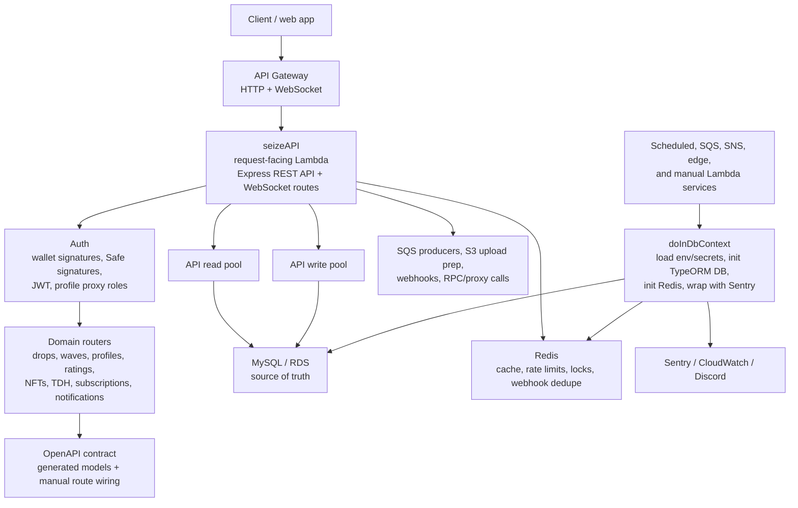

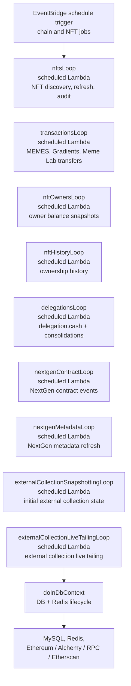

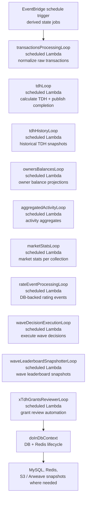

```mermaid
%%{init: {"flowchart": {"nodeSpacing": 24, "rankSpacing": 40, "curve": "basis"}} }%%
flowchart TD
  SupportSchedules["EventBridge schedule trigger<br/>support and media jobs"] --> SubscriptionsDaily["subscriptionsDaily<br/>scheduled Lambda<br/>daily subscription processing"]
  SubscriptionsTopUpLoop["subscriptionsTopUpLoop<br/>scheduled Lambda<br/>subscription top-ups"]
  DiscoverEnsLoop["discoverEnsLoop<br/>scheduled Lambda<br/>discover ENS names"]
  RefreshEnsLoop["refreshEnsLoop<br/>scheduled Lambda<br/>refresh known ENS names"]
  EthPriceLoop["ethPriceLoop<br/>scheduled Lambda<br/>ETH price snapshots"]
  MintAnnouncementsLoop["mintAnnouncementsLoop<br/>scheduled Lambda<br/>mint announcement automation"]
  ArtCurationNftWatchLoop["artCurationNftWatchLoop<br/>scheduled Lambda<br/>watch curated NFT state"]
  RememesLoop["rememesLoop<br/>scheduled Lambda<br/>S3, metadata, and file variants"]
  RoyaltiesLoop["royaltiesLoop<br/>scheduled Lambda<br/>royalty state refresh"]
  DbDumpsDaily["dbDumpsDaily<br/>scheduled Lambda<br/>daily database dumps"]
  NextgenMediaUploader["nextgenMediaUploader<br/>scheduled Lambda<br/>upload NextGen media"]
  NextgenMediaImageResolutions["nextgenMediaImageResolutions<br/>scheduled Lambda<br/>generate NextGen image resolutions"]
  SubscriptionsDaily ~~~ SubscriptionsTopUpLoop
  SubscriptionsTopUpLoop ~~~ DiscoverEnsLoop
  DiscoverEnsLoop ~~~ RefreshEnsLoop
  RefreshEnsLoop ~~~ EthPriceLoop
  EthPriceLoop ~~~ MintAnnouncementsLoop
  MintAnnouncementsLoop ~~~ ArtCurationNftWatchLoop
  ArtCurationNftWatchLoop ~~~ RememesLoop
  RememesLoop ~~~ RoyaltiesLoop
  RoyaltiesLoop ~~~ DbDumpsDaily
  DbDumpsDaily ~~~ NextgenMediaUploader
  NextgenMediaUploader ~~~ NextgenMediaImageResolutions
  NextgenMediaImageResolutions --> SupportRuntime["doInDbContext<br/>DB + Redis lifecycle"]
  SupportRuntime --> SupportExternal["MySQL, Redis,<br/>S3, ENS/RPC, Arweave as needed"]
```

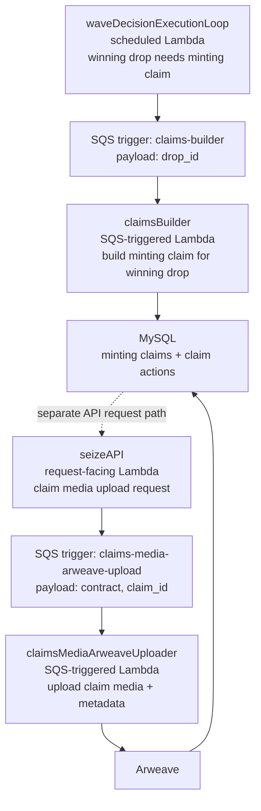

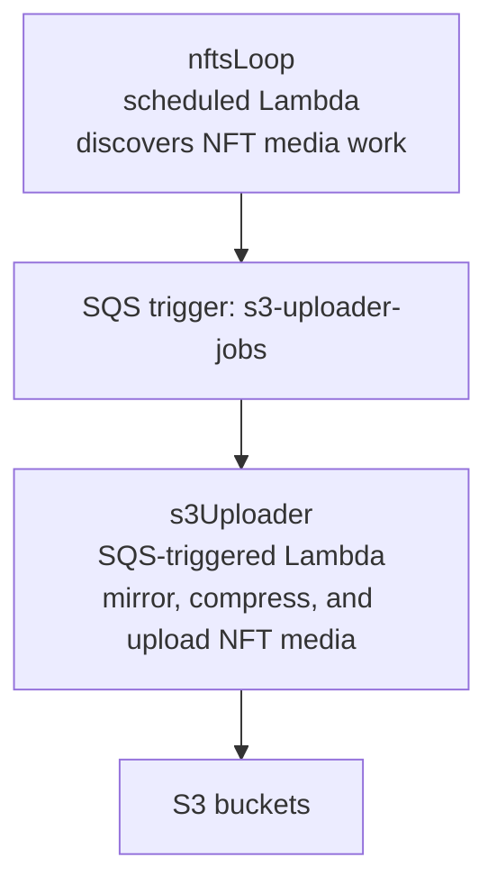

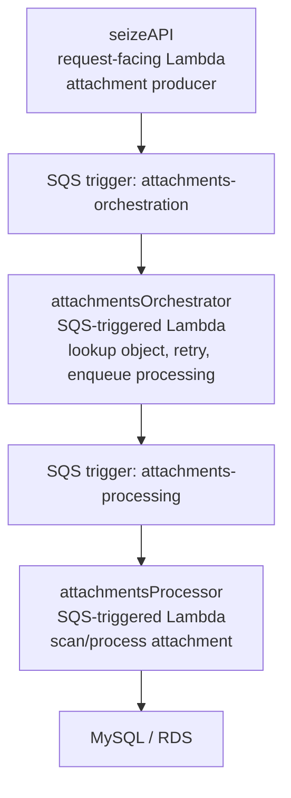

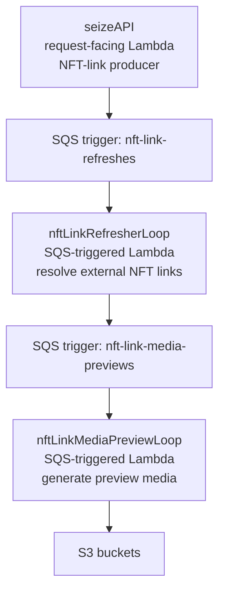

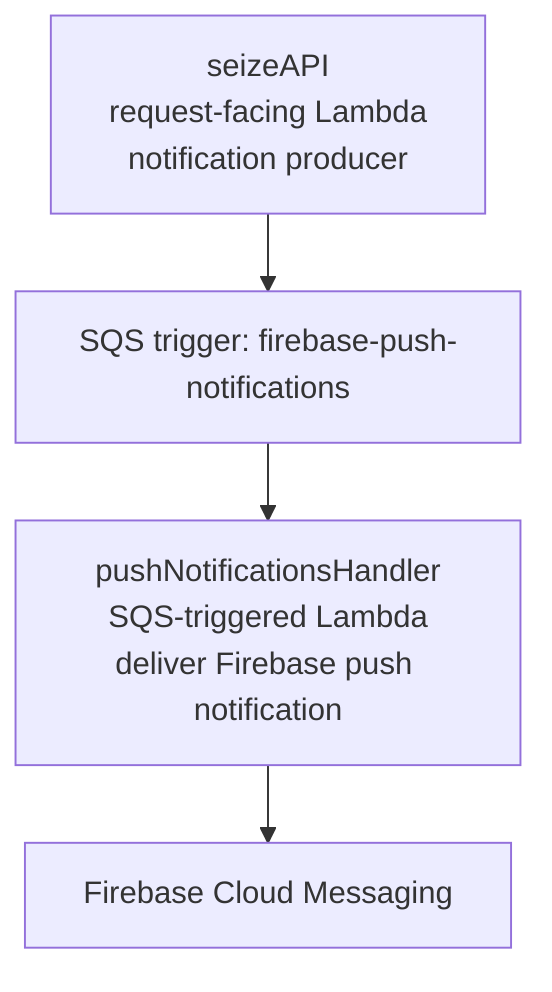

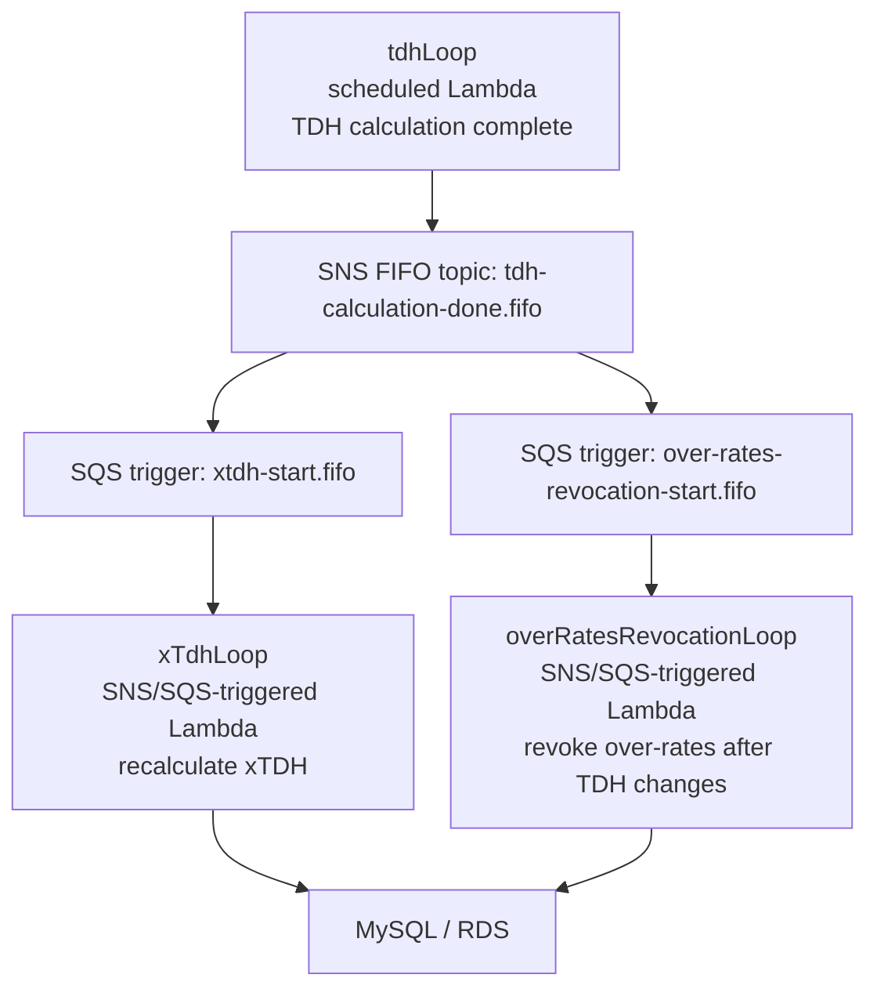

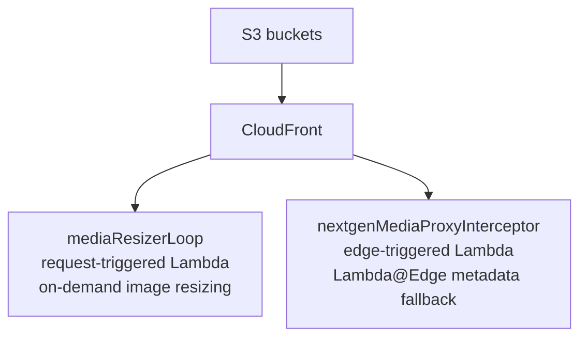

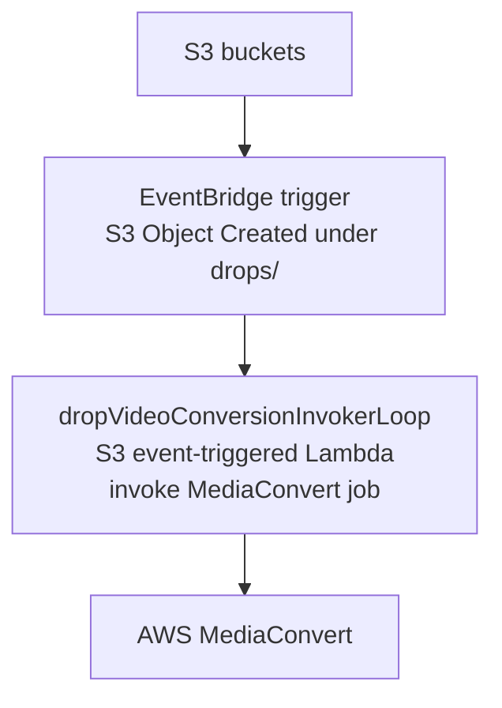

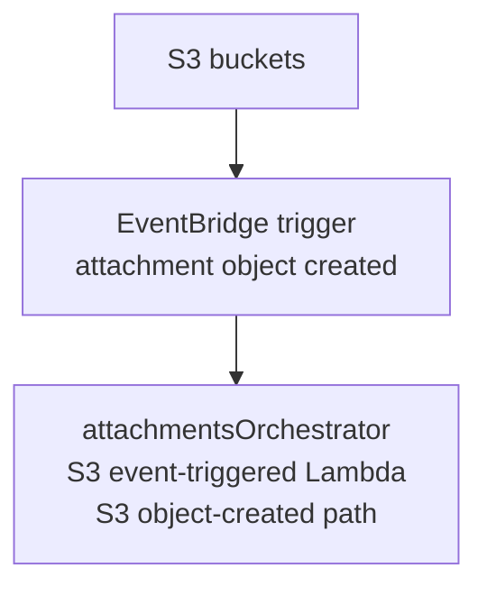

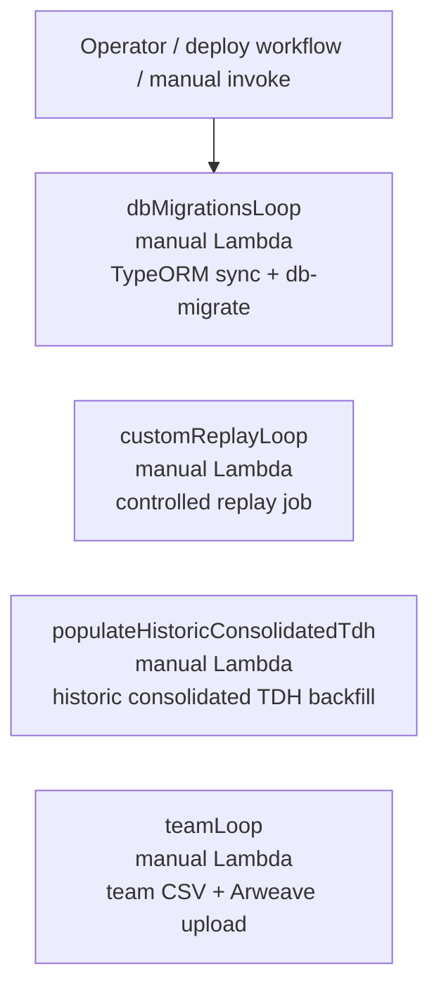

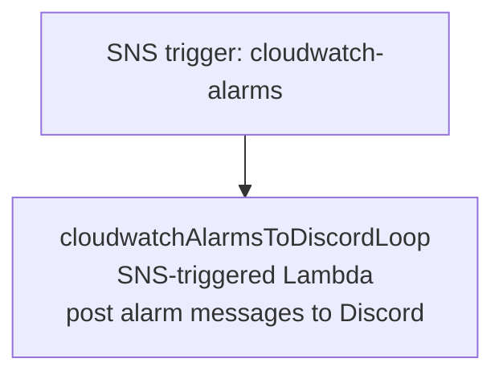

The vertical inventory keeps the rendered width bounded. The specific interaction diagrams below call out the queue and DB handoffs where ordering matters.

## Runtime Shape

The API Lambda is the public synchronous boundary. It initializes local config or AWS secrets, opens MySQL read/write pools, initializes Redis, configures Passport JWT authentication, registers all routers, and then serves HTTP through `serverless-http`. The same handler also branches on API Gateway WebSocket route keys for `$connect`, `$disconnect`, and `$default` messages.

Background Lambdas use a shared `doInDbContext` wrapper. That wrapper prepares environment/secrets, initializes TypeORM-backed DB access, initializes Redis, runs the job, then disconnects. This gives loop jobs a consistent lifecycle and keeps each worker independently deployable.

MySQL is the integration contract between nearly all modules. API routes, scheduled pollers, queue workers, and derived-data loops all read and write shared tables. Redis is secondary and mostly disposable: API request cache, rate limiting, webhook dedupe, locks, and selected feature caches can fail open or be repopulated from MySQL.

## Main Data Flows

1. Client requests enter through API Gateway and land in `seizeAPI`.
2. The API validates input, authenticates JWT or anonymous context, reads/writes MySQL, uses Redis for cache/rate limiting, and sometimes publishes SQS work.
3. Scheduled ingestion Lambdas poll Ethereum/RPC/Alchemy/Etherscan, normalize chain state, and write canonical rows into MySQL.
4. Derived-data Lambdas read canonical tables and write projections such as TDH, owner balances, aggregated activity, wave decisions, leaderboards, metrics, and reputation aggregates.
5. SQS workers handle slow or retryable side effects through named queues: claim building, claim media Arweave uploads, S3 media mirroring, attachment orchestration/processing, NFT link resolution/previews, xTDH recalculation, and Firebase push notifications.
6. S3 and CloudFront serve media. Some paths have specialized Lambda behavior: on-demand resizing, video conversion, and NextGen metadata placeholder interception.
7. Operational signals flow to Sentry, CloudWatch alarms, Discord, and SNS.

## API Boundary

The API is organized by domain routers under `src/api-serverless/src`. The OpenAPI file defines the public contract and generated models, while route implementation remains manual. This gives strong response model consistency without forcing generated routing.

Important API responsibilities:

- Authentication and refresh-token flows.
- Public read APIs for NFTs, TDH, waves, drops, profiles, community metrics, subscriptions, and notifications.
- Authenticated social writes: drops, votes, reactions, curations, subscriptions, groups, proxies, minting claims, and push settings.
- Upload preparation and multipart completion for drop media, wave media, distribution photos, and attachments.
- WebSocket connection registration and real-time wave-related messages.
- Operational endpoints such as health, docs, RPC/proxy routes, webhooks, and deploy-related routes.

## Database Boundary

There are two DB access modes:

- API mode uses mysql read/write pools. Simple SQL classification routes `INSERT`, `UPDATE`, `DELETE`, and `REPLACE` to the write pool; other queries default to the read pool unless forced.
- Loop mode uses TypeORM initialization and the shared `SqlExecutor` abstraction. Most schema ownership lives in entities, with `dbMigrationsLoop` running TypeORM synchronization and optional `db-migrate` migrations.

The core architectural choice is that MySQL is both the system of record and the internal integration layer. This keeps the system understandable, but it makes table contracts, migrations, backfills, indexes, and worker idempotency especially important.

## Async Processing

There are three async patterns:

- EventBridge scheduled pollers: periodic ingestion, aggregation, refresh, and operational jobs.
- SQS workers: retryable side effects and heavier processing.
- DB-backed event processing: the `events` table stores processable events, and `rateEventProcessingLoop` locks and dispatches them to listener implementations.

Most long-running scheduled jobs have reserved concurrency set low, usually `1`, which protects shared tables from concurrent writer races. SQS workers use queue visibility timeouts, DLQs, and batch failure reporting where configured.

## Claim Queue Flows

The claim flows are representative of how this codebase uses SQS: synchronous code commits the durable state change first, then publishes a small message to a purpose-built queue, and the worker re-reads the full entity from MySQL before doing expensive or external work.

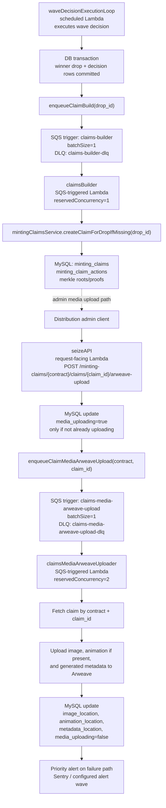

Important details:

- `claims-builder` messages are produced by `waveDecisionExecutionLoop` after the wave decision has been committed. If enqueueing fails, the decision remains committed and a priority alert is sent.
- `claimsBuilder` consumes `{ drop_id }`, then calls the minting-claim service to create the missing claim from the winning drop.
- `claims-media-arweave-upload` messages are produced by the API only after the claim row is locked with `media_uploading=true`.
- If media upload enqueueing fails, the API tries to roll `media_uploading` back to `false`.
- `claimsMediaArweaveUploader` consumes `{ contract, claim_id }`, re-fetches the claim, uploads media and metadata to Arweave, then stores Arweave transaction ids back on the claim row.

## Deployment Model

Deployment is service-by-service through the generated GitHub Actions workflow. The workflow exposes `api` and each Lambda service as a deploy choice.

Most Lambdas deploy through each service's `serverless.yaml`. The API is packaged from `src/api-serverless` and deployed by direct AWS Lambda update commands as `seizeAPI`. `mediaResizerLoop` also has a direct Lambda update path. `nextgenMediaProxyInterceptor` deploys as a Lambda@Edge version and updates CloudFront associations through its shell script.

Typical deployment order when schema or generated API contracts change:

1. `dbMigrationsLoop` if entities or DB migrations changed.
2. Producer Lambdas that start writing new fields or queue payloads.
3. Consumer Lambdas that read those new fields or consume those payloads.
4. `api` when routes, OpenAPI models, auth behavior, upload behavior, or user-facing responses changed.

For a documentation-only change, no Lambda redeploy is required.

## Architecture Notes

The strongest part of the architecture is its operational decomposition. Expensive, slow, and retryable work is mostly outside the request path, and the loop structure makes individual jobs independently deployable.

The biggest tradeoff is the DB-centered coupling. Many services share tables directly, so changes need to be treated as cross-service contracts even when they look local. The safest pattern is additive schema changes first, backward-compatible writers/readers second, and cleanup only after all dependent Lambdas are deployed.

The API Lambda has a broad blast radius. It is pragmatic and easy to route through one entrypoint, but it owns many unrelated concerns: public REST, auth, WebSocket handling, webhooks, upload preparation, docs, health, and proxy endpoints. Continued growth may eventually justify splitting high-risk or high-traffic boundaries.

Redis should remain treated as an optimization and coordination layer, not a source of truth. The current design mostly follows that rule.

Media and edge processing are the most heterogeneous deployment area. S3, CloudFront, MediaConvert, Lambda@Edge, native modules, and specialized build packaging all meet there, so changes in this area need more deployment and runtime verification than ordinary DB/API changes.
