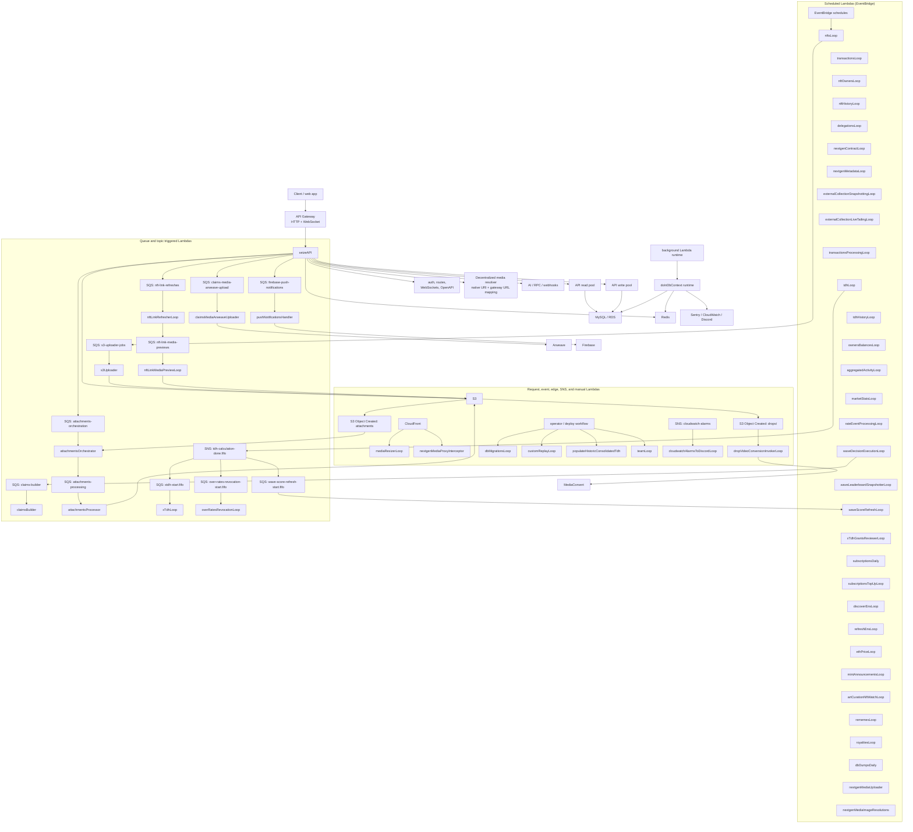
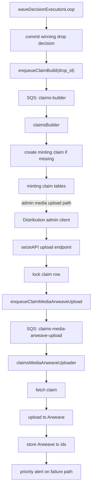

# Architecture Overview

This backend is a serverless, database-centered TypeScript system for 6529.io.
The main runtime pieces are:

- A single public API Lambda (`seizeAPI`) running Express.
- Many independently deployed background Lambdas for chain ingestion, derived data, media processing, notifications, and operations.
- MySQL as the source of truth.
- Redis as shared cache, rate-limit, dedupe, and short-lived coordination storage.
- SQS and EventBridge as the async execution fabric.
- S3, CloudFront, Arweave, Ethereum/RPC providers, Firebase, Sentry, CloudWatch, Discord, and SNS around the core.

## High-Level Diagram

This is the compact map. Lambda boxes are intentionally just service names; trigger type is shown by the surrounding group or the queue/topic feeding the Lambda. The tables below carry the longer descriptions so the diagram stays readable.

## Lambda Inventory

### Scheduled Lambdas (EventBridge)

| Lambda | Purpose |
|---|---|
| `nftsLoop` | Discover, refresh, and audit NFTs. |
| `transactionsLoop` | Index MEMES, Gradients, and Meme Lab transfers. |
| `nftOwnersLoop` | Maintain current owner balance snapshots. |
| `nftHistoryLoop` | Maintain ownership history. |
| `delegationsLoop` | Sync delegation.cash and consolidation data. |
| `nextgenContractLoop` | Index NextGen contract events. |
| `nextgenMetadataLoop` | Refresh NextGen metadata. |
| `externalCollectionSnapshottingLoop` | Snapshot external collection ownership. |
| `externalCollectionLiveTailingLoop` | Live-tail external collection transfers. |
| `transactionsProcessingLoop` | Normalize raw transactions into processed state. |
| `tdhLoop` | Calculate TDH and publish TDH completion. |
| `tdhHistoryLoop` | Write historical TDH snapshots. |
| `ownersBalancesLoop` | Project owner balance aggregates. |
| `aggregatedActivityLoop` | Calculate activity aggregates. |
| `marketStatsLoop` | Aggregate market stats for MEMES, Lab, Gradients, and NextGen. |
| `rateEventProcessingLoop` | Process DB-backed rating events. |
| `waveDecisionExecutionLoop` | Execute wave decisions and enqueue claim builds. |
| `waveLeaderboardSnapshotterLoop` | Snapshot wave leaderboards. |
| `xTdhGrantsReviewerLoop` | Review xTDH grants. |
| `subscriptionsDaily` | Process daily subscription work. |
| `subscriptionsTopUpLoop` | Process subscription top-ups. |
| `discoverEnsLoop` | Discover ENS names. |
| `refreshEnsLoop` | Refresh known ENS names. |
| `ethPriceLoop` | Snapshot ETH price. |
| `mintAnnouncementsLoop` | Publish mint announcements. |
| `artCurationNftWatchLoop` | Watch curated NFT state. |
| `rememesLoop` | Refresh rememes S3 files and metadata. |
| `royaltiesLoop` | Refresh royalty state. |
| `dbDumpsDaily` | Create daily database dumps. |
| `nextgenMediaUploader` | Upload NextGen media. |
| `nextgenMediaImageResolutions` | Generate NextGen image resolutions. |

### Triggered Lambdas

| Lambda | Trigger | Purpose |
|---|---|---|
| `api` / `seizeAPI` | API Gateway HTTP/WebSocket | Public REST API and WebSocket boundary. |
| `claimsBuilder` | SQS `claims-builder` | Build minting claims from winning drops. |
| `claimsMediaArweaveUploader` | SQS `claims-media-arweave-upload` | Upload claim media and metadata to Arweave. |
| `s3Uploader` | SQS `s3-uploader-jobs` | Mirror, compress, and upload NFT media. |
| `attachmentsOrchestrator` | SQS `attachments-orchestration` and S3 object-created event | Find uploaded attachment objects, retry, and enqueue processing. |
| `attachmentsProcessor` | SQS `attachments-processing` | Scan/process attachments. |
| `nftLinkRefresherLoop` | SQS `nft-link-refreshes` | Resolve external NFT links. |
| `nftLinkMediaPreviewLoop` | SQS `nft-link-media-previews` | Generate media previews for NFT links. |
| `pushNotificationsHandler` | SQS `firebase-push-notifications` | Deliver Firebase push notifications. |
| `xTdhLoop` | SNS `tdh-calculation-done.fifo` via SQS `xtdh-start.fifo` | Recalculate xTDH after TDH finishes. |
| `overRatesRevocationLoop` | SNS `tdh-calculation-done.fifo` via SQS `over-rates-revocation-start.fifo` | Revoke over-rates after TDH changes. |
| `waveScoreRefreshLoop` | SNS `tdh-calculation-done.fifo` via SQS `wave-score-refresh-start.fifo` | Refresh materialized wave REP and Wave Score discovery fields after TDH changes. |
| `mediaResizerLoop` | CloudFront/request path | Resize images on demand. |
| `nextgenMediaProxyInterceptor` | Lambda@Edge / CloudFront request | Provide NextGen metadata fallback. |
| `dropVideoConversionInvokerLoop` | S3 object-created event for `drops/` | Invoke MediaConvert for uploaded drop videos. |
| `cloudwatchAlarmsToDiscordLoop` | SNS `cloudwatch-alarms` | Post CloudWatch alarms to Discord. |

### Manual Or One-Off Lambdas

| Lambda | Purpose |
|---|---|
| `dbMigrationsLoop` | TypeORM entity synchronization, usually run from deploy workflow. |
| `customReplayLoop` | Controlled replay job. |
| `populateHistoricConsolidatedTdh` | Historic consolidated TDH backfill. |
| `teamLoop` | Team CSV and Arweave upload. |

## Runtime Shape

The API Lambda is the public synchronous boundary. It initializes local config or AWS secrets, opens MySQL read/write pools, initializes Redis, configures Passport JWT authentication, registers all routers, and then serves HTTP through `serverless-http`. The same handler also branches on API Gateway WebSocket route keys for `$connect`, `$disconnect`, and `$default` messages.

Background Lambdas use a shared `doInDbContext` wrapper. That wrapper prepares environment/secrets, initializes TypeORM-backed DB access, initializes Redis, runs the job, then disconnects. This gives loop jobs a consistent lifecycle and keeps each worker independently deployable.

MySQL is the integration contract between nearly all modules. API routes, scheduled pollers, queue workers, and derived-data loops all read and write shared tables. Redis is secondary and mostly disposable: API request cache, rate limiting, webhook dedupe, locks, and selected feature caches can fail open or be repopulated from MySQL.

## Main Data Flows

1. Client requests enter through API Gateway and land in `seizeAPI`.
2. The API validates input, authenticates JWT or anonymous context, reads/writes MySQL, uses Redis for cache/rate limiting, and sometimes publishes SQS work.
3. Scheduled ingestion Lambdas poll Ethereum/RPC/Alchemy/Etherscan, normalize chain state, and write canonical rows into MySQL.
4. Derived-data Lambdas read canonical tables and write projections such as TDH, owner balances, aggregated activity, wave decisions, leaderboards, metrics, and reputation aggregates.
5. SQS workers handle slow or retryable side effects through named queues: claim building, claim media Arweave uploads, S3 media mirroring, attachment orchestration/processing, NFT link resolution/previews, xTDH recalculation, and Firebase push notifications.
6. S3 and CloudFront serve media. Some paths have specialized Lambda behavior: on-demand resizing, video conversion, and NextGen metadata placeholder interception.
7. Operational signals flow to Sentry, CloudWatch alarms, Discord, and SNS.

## API Boundary

The API is organized by domain routers under `src/api-serverless/src`. The OpenAPI file defines the public contract and generated models. Legacy routes are wired manually, while newer OpenAPI operations can opt into generated route wiring through `x-6529-router` and thin domain handlers.

Important API responsibilities:

- Authentication and refresh-token flows.
- Public read APIs for NFTs, TDH, waves, drops, profiles, community metrics, subscriptions, and notifications.
- Public OG metadata inputs for profile, wave, and drop link previews under `/og-metadata`.
- Public profile-native CMS primary package lookup under
  `/profile-cms/{handle}/primary`, returning the published production-safe CMS
  V1 package envelope used by `/{handle}/index.html`; draft, failed, fixture,
  and missing primary packages return 404.
- Authenticated profile-native CMS publish hardening under `/profile-cms`,
  including EIP-712 publish intent verification, canonical IPFS/Arweave receipt
  checks, rollback/archive endpoints, and package export data for future
  standalone renderers and mirrors.
- Public decentralized media resolution under `/media/resolve`, which maps
  native `ipfs://`, `ipns://`, and `ar://` references plus recognized gateway
  URLs to canonical native URIs, `media.6529.io` resolver URLs, and explicit
  external fallback URLs. This v1 API does not proxy media bytes.
- Authenticated social writes: drops, votes, reactions, curations, subscriptions, groups, proxies, profile CMS package drafts/publish actions, minting claims, and push settings.
- Upload preparation and multipart completion for drop media, wave media, distribution photos, and attachments.
- WebSocket connection registration and real-time wave-related messages.
- Operational endpoints such as health, docs, RPC/proxy routes, webhooks, and deploy-related routes.

Wave rows can be top-level waves or subwaves through the nullable `parent_wave_id` column. Top-level wave discovery endpoints exclude subwaves, while `/waves/{id}/subwaves` lists child wave overviews. Subwave read access also requires the parent wave to be visible, and deleting a parent wave cascades through the API service to delete its subwaves.

The waves v2 read boundary keeps timeline, reply-thread, and curation feeds as separate contracts. `/v2/waves/{id}/drops` returns the wave timeline feed, `/v2/drops/{id}/replies` returns the reply thread for a root drop after resolving its owning visible wave, and `/v2/waves/{id}/curations/{curation_id}/drops` returns drops for one wave curation.

The waves v2 boundary also exposes `/v2/official-waves`, backed by the `official_waves` selector table. It returns readable `ApiWaveOverview` rows for listed wave ids and skips stale entries whose wave row no longer exists.

Wave creators and wave admins can manage arbitrary wave metadata pairs through `/v2/waves/{id}/metadata`. Read access follows the same wave visibility rules as other wave v2 reads, while writes are restricted to the creator or members of the wave admin group. Metadata is stored in `waves_metadatas`, keyed by wave id and metadata key.

Wave creators and wave admins can attach one inline poll to a chat drop through the drop creation API. Poll definitions, options, and votes are stored in `drop_polls`, `drop_poll_options`, and `drop_poll_votes`; poll reads follow existing drop and wave visibility rules, include the authenticated profile's selected option numbers, and poll votes replace the acting profile's previous answers for that poll. A poll vote also creates the normal notification and Firebase push notification path for the drop author with the voter identity and selected option labels.

Wave poll listing is exposed through `/v2/waves/{id}/polls`, returning paginated `ApiDropV2` data for drops that have inline polls, ordered by drop `created_at` descending by default, with optional `sort=closing_time` and `state=OPEN|CLOSED` filtering.

## Database Boundary

There are two DB access modes:

- API mode uses mysql read/write pools. Simple SQL classification routes `INSERT`, `UPDATE`, `DELETE`, and `REPLACE` to the write pool; other queries default to the read pool unless forced.
- Loop mode uses TypeORM initialization and the shared `SqlExecutor` abstraction. Schema ownership is entities-first: add or update TypeORM entity classes, export them from `src/entities/entities.ts`, and let `dbMigrationsLoop` run entity synchronization. Do not create SQL migrations for schema changes unless explicitly requested; migrations are reserved for one-off data work or views.

The core architectural choice is that MySQL is both the system of record and the internal integration layer. This keeps the system understandable, but it makes table contracts, migrations, backfills, indexes, and worker idempotency especially important.

Profile-native CMS packages are stored in `profile_cms_packages`. The table
keeps the complete CMS V1 package JSON, indexed profile/package/version/hash
fields, publication state, primary-package flags, validation results, and
storage receipt indexes for IPFS, Arweave, S3, and fixture receipts. The API
publish path validates CMS V1 semantics, enforces the submitted payload and
package hashes, rejects fixture signatures/storage for production publish,
verifies EIP-712 publish intent, requires one canonical IPFS or Arweave receipt,
consumes the verified typed-data hash to prevent publish-intent replay, and
supersedes the previous primary package in one transaction.

Profile CMS pointer history is stored in `profile_cms_pointer_events`. Publish,
set-primary, supersede, rollback, and archive events keep package hashes,
previous-primary links, actor profile ids, signature metadata, and canonical
storage receipts. `event_sequence` preserves logical ordering for events written
in the same millisecond so the primary pointer history can be reconstructed and
exported for future mirrors. Consumed publish intent hashes are stored in
`profile_cms_publish_signatures`.

## Async Processing

There are three async patterns:

- EventBridge scheduled pollers: periodic ingestion, aggregation, refresh, and operational jobs.
- SQS workers: retryable side effects and heavier processing.
- DB-backed event processing: the `events` table stores processable events, and `rateEventProcessingLoop` locks and dispatches them to listener implementations.

Most long-running scheduled jobs have reserved concurrency set low, usually `1`, which protects shared tables from concurrent writer races. SQS workers use queue visibility timeouts, DLQs, and batch failure reporting where configured.

## Drops -> Minting Claim Queue Flows

This is the concrete path where a winning drop becomes a minting claim. It is also representative of how this codebase uses SQS: synchronous code commits the durable state change first, then publishes a small message to a purpose-built queue, and the worker re-reads the full entity from MySQL before doing expensive or external work.

Important details:

- `claims-builder` messages are produced by `waveDecisionExecutionLoop` after the wave decision has been committed. If enqueueing fails, the decision remains committed and a priority alert is sent.
- `claimsBuilder` consumes `{ drop_id }`, then calls the minting-claim service to create the missing claim from the winning drop.
- `claims-media-arweave-upload` messages are produced by the API only after the claim row is locked with `media_uploading=true`.
- If media upload enqueueing fails, the API tries to roll `media_uploading` back to `false`.
- `claimsMediaArweaveUploader` consumes `{ contract, claim_id }`, re-fetches the claim, uploads media and metadata to Arweave, then stores Arweave transaction ids back on the claim row.

## Deployment Model

Deployment is service-by-service through the generated GitHub Actions workflow. The workflow exposes `api` and each Lambda service as a deploy choice.

Most Lambdas deploy through each service's `serverless.yaml`. The API is packaged from `src/api-serverless` and deployed by direct AWS Lambda update commands as `seizeAPI`. `mediaResizerLoop` also has a direct Lambda update path. `nextgenMediaProxyInterceptor` deploys as a Lambda@Edge version and updates CloudFront associations through its shell script.

Typical deployment order when schema or generated API contracts change:

1. `dbMigrationsLoop` if TypeORM entities changed, or if an explicit data/view migration was requested.
2. Producer Lambdas that start writing new fields or queue payloads.
3. Consumer Lambdas that read those new fields or consume those payloads.
4. `api` when routes, OpenAPI models, auth behavior, upload behavior, or user-facing responses changed.

For a documentation-only change, no Lambda redeploy is required.

## Architecture Notes

The strongest part of the architecture is its operational decomposition. Expensive, slow, and retryable work is mostly outside the request path, and the loop structure makes individual jobs independently deployable.

The biggest tradeoff is the DB-centered coupling. Many services share tables directly, so changes need to be treated as cross-service contracts even when they look local. The safest pattern is additive schema changes first, backward-compatible writers/readers second, and cleanup only after all dependent Lambdas are deployed.

The API Lambda has a broad blast radius. It is pragmatic and easy to route through one entrypoint, but it owns many unrelated concerns: public REST, auth, WebSocket handling, webhooks, upload preparation, docs, health, and proxy endpoints. Continued growth may eventually justify splitting high-risk or high-traffic boundaries.

Redis should remain treated as an optimization and coordination layer, not a source of truth. The current design mostly follows that rule.

Media and edge processing are the most heterogeneous deployment area. S3, CloudFront, MediaConvert, Lambda@Edge, native modules, and specialized build packaging all meet there, so changes in this area need more deployment and runtime verification than ordinary DB/API changes.
