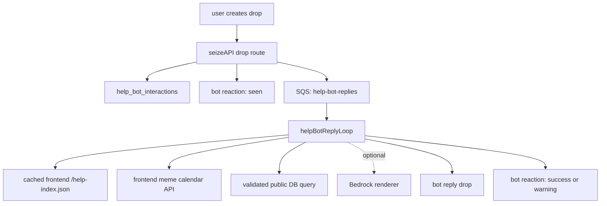
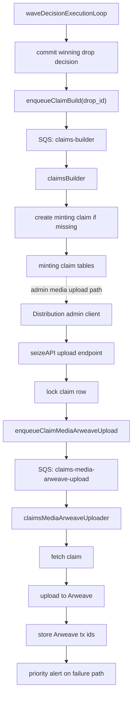

# Architecture Overview

This backend is a serverless, database-centered TypeScript system for 6529.io.
The main runtime pieces are:

- A single public API Lambda (`seizeAPI`) running Express.
- Many independently deployed background Lambdas for chain ingestion, derived data, media processing, notifications, and operations.
- MySQL as the source of truth.
- Redis as shared cache, rate-limit, dedupe, and short-lived coordination storage.
- SQS and EventBridge as the async execution fabric.
- S3, CloudFront, Arweave, Ethereum/RPC providers, Firebase, Sentry, CloudWatch, Discord, and SNS around the core.

## High-Level Diagram

This is the compact map. Lambda boxes are intentionally just service names; trigger type is shown by the surrounding group or the queue/topic feeding the Lambda. The tables below carry the longer descriptions so the diagram stays readable.

```mermaid
%%{init: {"flowchart": {"nodeSpacing": 24, "rankSpacing": 58, "curve": "basis"}} }%%
flowchart TD
  Client["Client / web app"] --> APIGW["API Gateway<br/>HTTP + WebSocket"]
  APIGW --> SeizeAPI["seizeAPI"]

  SeizeAPI --> Auth["auth, routes,<br/>WebSockets, OpenAPI"]
  SeizeAPI --> ReadPool["API read pool"]
  SeizeAPI --> WritePool["API write pool"]
  ReadPool --> MySQL["MySQL / RDS"]
  WritePool --> MySQL
  SeizeAPI --> Redis["Redis"]
  SeizeAPI --> S3["public S3 media bucket"]
  SeizeAPI --> DropMediaIngestS3["private drop media ingest S3 bucket"]
  SeizeAPI --> MediaResolver["Decentralized media resolver<br/>native URI + gateway URL mapping"]
  SeizeAPI --> AiRpc["AI / RPC / webhooks"]

  subgraph Scheduled["Scheduled Lambdas (EventBridge)"]
    direction TB
    EventBridge["EventBridge schedules"] --> NftsLoop["nftsLoop"]
    NftsLoop ~~~ TransactionsLoop["transactionsLoop"]
    TransactionsLoop ~~~ NftOwnersLoop["nftOwnersLoop"]
    NftOwnersLoop ~~~ NftHistoryLoop["nftHistoryLoop"]
    NftHistoryLoop ~~~ DelegationsLoop["delegationsLoop"]
    DelegationsLoop ~~~ NextgenContractLoop["nextgenContractLoop"]
    NextgenContractLoop ~~~ NextgenMetadataLoop["nextgenMetadataLoop"]
    NextgenMetadataLoop ~~~ ExternalSnapshotLoop["externalCollectionSnapshottingLoop"]
    ExternalSnapshotLoop ~~~ ExternalLiveTailLoop["externalCollectionLiveTailingLoop"]
    ExternalLiveTailLoop ~~~ TransactionsProcessingLoop["transactionsProcessingLoop"]
    TransactionsProcessingLoop ~~~ TdhLoop["tdhLoop"]
    TdhLoop ~~~ TdhHistoryLoop["tdhHistoryLoop"]
    TdhHistoryLoop ~~~ OwnersBalancesLoop["ownersBalancesLoop"]
    OwnersBalancesLoop ~~~ AggregatedActivityLoop["aggregatedActivityLoop"]
    AggregatedActivityLoop ~~~ MarketStatsLoop["marketStatsLoop"]
    MarketStatsLoop ~~~ RateEventProcessingLoop["rateEventProcessingLoop"]
    RateEventProcessingLoop ~~~ WaveDecisionExecutionLoop["waveDecisionExecutionLoop"]
    WaveDecisionExecutionLoop ~~~ WaveLeaderboardSnapshotterLoop["waveLeaderboardSnapshotterLoop"]
    WaveLeaderboardSnapshotterLoop ~~~ WaveDropMetricsRefreshLoop["waveDropMetricsRefreshLoop"]
    WaveDropMetricsRefreshLoop ~~~ WaveScoreRefreshLoop["waveScoreRefreshLoop"]
    WaveScoreRefreshLoop ~~~ XTdhGrantsReviewerLoop["xTdhGrantsReviewerLoop"]
    XTdhGrantsReviewerLoop ~~~ SubscriptionsDaily["subscriptionsDaily"]
    SubscriptionsDaily ~~~ SubscriptionsTopUpLoop["subscriptionsTopUpLoop"]
    SubscriptionsTopUpLoop ~~~ DiscoverEnsLoop["discoverEnsLoop"]
    DiscoverEnsLoop ~~~ RefreshEnsLoop["refreshEnsLoop"]
    RefreshEnsLoop ~~~ EthPriceLoop["ethPriceLoop"]
    EthPriceLoop ~~~ MintAnnouncementsLoop["mintAnnouncementsLoop"]
    MintAnnouncementsLoop ~~~ ArtCurationNftWatchLoop["artCurationNftWatchLoop"]
    ArtCurationNftWatchLoop ~~~ RememesLoop["rememesLoop"]
    RememesLoop ~~~ RoyaltiesLoop["royaltiesLoop"]
    RoyaltiesLoop ~~~ DbDumpsDaily["dbDumpsDaily"]
    DbDumpsDaily ~~~ NextgenMediaUploader["nextgenMediaUploader"]
    NextgenMediaUploader ~~~ NextgenMediaImageResolutions["nextgenMediaImageResolutions"]
  end

  subgraph Queues["Queue and topic triggered Lambdas"]
    direction TB
    WaveDecisionExecutionLoop --> ClaimsBuilderQueue["SQS: claims-builder"] --> ClaimsBuilder["claimsBuilder"]
    SeizeAPI --> ClaimsMediaQueue["SQS: claims-media-arweave-upload"] --> ClaimsMediaArweaveUploader["claimsMediaArweaveUploader"]
    NftsLoop --> S3UploaderQueue["SQS: s3-uploader-jobs"] --> S3Uploader["s3Uploader"]
    SeizeAPI --> AttachOrchestrationQueue["SQS: attachments-orchestration"] --> AttachmentsOrchestrator["attachmentsOrchestrator"]
    AttachmentsOrchestrator --> AttachProcessingQueue["SQS: attachments-processing"] --> AttachmentsProcessor["attachmentsProcessor"]
    SeizeAPI --> DropMediaSanitizerQueue["SQS: drop-media-sanitizer"] --> DropMediaSanitizer["dropMediaSanitizer"]
    SeizeAPI --> NftLinkRefreshQueue["SQS: nft-link-refreshes"] --> NftLinkRefresherLoop["nftLinkRefresherLoop"]
    NftLinkRefresherLoop --> NftLinkPreviewQueue["SQS: nft-link-media-previews"] --> NftLinkMediaPreviewLoop["nftLinkMediaPreviewLoop"]
    SeizeAPI --> PushQueue["SQS: firebase-push-notifications"] --> PushNotificationsHandler["pushNotificationsHandler"]
    SeizeAPI --> HelpBotQueue["SQS: help-bot-replies"] --> HelpBotReplyLoop["helpBotReplyLoop"]
    SeizeAPI --> ReleaseNotesQueue["SQS: release-note-generation"] --> ReleaseNotesGenerationLoop["releaseNotesGenerationLoop"]
    SeizeAPI --> WaveDropMetricsDirtyQueue["SQS: wave-drop-metrics-refresh-dirty.fifo"] --> WaveDropMetricsRefreshLoop
    SeizeAPI --> WaveScoreDirtyQueue["SQS: wave-score-refresh-dirty.fifo"] --> WaveScoreRefreshLoop
    TdhLoop --> TdhDoneTopic["SNS: tdh-calculation-done.fifo"]
    TdhDoneTopic --> XTdhQueue["SQS: xtdh-start.fifo"] --> XTdhLoop["xTdhLoop"]
    XTdhLoop --> XTdhQueue
    TdhDoneTopic --> OverRatesQueue["SQS: over-rates-revocation-start.fifo"] --> OverRatesRevocationLoop["overRatesRevocationLoop"]
    TdhDoneTopic --> WaveScoreRefreshQueue["SQS: wave-score-refresh-start.fifo"] --> WaveScoreRefreshLoop["waveScoreRefreshLoop"]
  end

  subgraph RequestEventManual["Request, event, edge, SNS, and manual Lambdas"]
    direction TB
    CloudFront["CloudFront"] --> MediaResizerLoop["mediaResizerLoop"]
    CloudFront --> NextgenMediaProxyInterceptor["nextgenMediaProxyInterceptor"]
    S3 --> DropsVideoCreatedRule["S3 Object Created: drops/"] --> DropVideoConversionInvokerLoop["dropVideoConversionInvokerLoop"]
    S3 --> AttachmentObjectCreatedRule["S3 Object Created: attachments"] --> AttachmentsOrchestrator
    Operator["operator / deploy workflow"] --> DbMigrationsLoop["dbMigrationsLoop"]
    Operator --> CustomReplayLoop["customReplayLoop"]
    Operator --> PopulateHistoricConsolidatedTdh["populateHistoricConsolidatedTdh"]
    Operator --> TeamLoop["teamLoop"]
    CloudwatchTopic["SNS: cloudwatch-alarms"] --> CloudwatchAlarmsToDiscordLoop["cloudwatchAlarmsToDiscordLoop"]
  end

  BackgroundWorkers["background Lambda runtime"] --> LambdaRuntime["doInDbContext runtime"]
  DropVideoConversionInvokerLoop --> EnvOnlyRuntime["environment-only runtime"]
  LambdaRuntime --> MySQL
  LambdaRuntime --> Redis
  LambdaRuntime --> Ops["Sentry / CloudWatch / Discord"]
  EnvOnlyRuntime --> Ops

  S3Uploader --> S3
  AttachmentsProcessor --> S3
  DropMediaSanitizer --> DropMediaIngestS3
  DropMediaSanitizer --> S3
  NftLinkMediaPreviewLoop --> S3
  ClaimsMediaArweaveUploader --> Arweave["Arweave"]
  PushNotificationsHandler --> Firebase["Firebase"]
  PushNotificationsHandler -->|recipient-scoped notification invalidation| APIGW
  DropVideoConversionInvokerLoop --> MediaConvert["MediaConvert"]
```

## Lambda Inventory

### Scheduled Lambdas (EventBridge)

| Lambda                               | Purpose                                                              |
| ------------------------------------ | -------------------------------------------------------------------- |
| `nftsLoop`                           | Discover, refresh, and audit NFTs.                                   |
| `transactionsLoop`                   | Index MEMES, Gradients, and Meme Lab transfers.                      |
| `nftOwnersLoop`                      | Maintain current owner balance snapshots.                            |
| `nftHistoryLoop`                     | Maintain ownership history.                                          |
| `delegationsLoop`                    | Sync delegation.cash and consolidation data.                         |
| `nextgenContractLoop`                | Index NextGen contract events.                                       |
| `nextgenMetadataLoop`                | Refresh NextGen metadata.                                            |
| `externalCollectionSnapshottingLoop` | Snapshot external collection ownership.                              |
| `externalCollectionLiveTailingLoop`  | Live-tail external collection transfers.                             |
| `transactionsProcessingLoop`         | Normalize raw transactions into processed state.                     |
| `tdhLoop`                            | Calculate TDH and publish TDH completion.                            |
| `tdhHistoryLoop`                     | Write historical TDH snapshots.                                      |
| `ownersBalancesLoop`                 | Project owner balance aggregates.                                    |
| `aggregatedActivityLoop`             | Calculate activity aggregates.                                       |
| `marketStatsLoop`                    | Aggregate market stats for MEMES, Lab, Gradients, and NextGen.       |
| `rateEventProcessingLoop`            | Process DB-backed rating events.                                     |
| `waveDecisionExecutionLoop`          | Execute wave decisions and enqueue claim builds.                     |
| `waveLeaderboardSnapshotterLoop`     | Snapshot wave leaderboards.                                          |
| `waveDropMetricsRefreshLoop`         | Scheduled fallback that drains dirty drop metric refresh requests.   |
| `waveScoreRefreshLoop`               | Scheduled fallback that drains dirty Wave Score refresh requests.    |
| `xTdhGrantsReviewerLoop`             | Review xTDH grants.                                                  |
| `subscriptionsDaily`                 | Process daily subscription work.                                     |
| `subscriptionsTopUpLoop`             | Process subscription top-ups.                                        |
| `discoverEnsLoop`                    | Discover ENS names.                                                  |
| `refreshEnsLoop`                     | Refresh known ENS names.                                             |
| `ethPriceLoop`                       | Snapshot ETH price every five minutes.                               |
| `mintAnnouncementsLoop`              | Publish mint announcements.                                          |
| `artCurationNftWatchLoop`            | Watch curated NFT state.                                             |
| `rememesLoop`                        | Refresh rememes S3 files and metadata.                               |
| `royaltiesLoop`                      | Refresh royalty state.                                               |
| `dbDumpsDaily`                       | Create daily database dumps.                                         |
| `nextgenMediaUploader`               | Upload NextGen media.                                                |
| `nextgenMediaImageResolutions`       | Generate NextGen image resolutions.                                  |
| `releaseBusStarter`                  | Reconcile queued immutable candidates and start one release train.   |
| `releaseBusCleaner`                  | Remove expired temporary release branches that no active train owns. |

### Triggered Lambdas

| Lambda                           | Trigger                                                                                                                            | Purpose                                                                                                                     |
| -------------------------------- | ---------------------------------------------------------------------------------------------------------------------------------- | --------------------------------------------------------------------------------------------------------------------------- |
| `api` / `seizeAPI`               | API Gateway HTTP/WebSocket                                                                                                         | Public REST API and WebSocket boundary.                                                                                     |
| `claimsBuilder`                  | SQS `claims-builder`                                                                                                               | Build minting claims from winning drops.                                                                                    |
| `claimsMediaArweaveUploader`     | SQS `claims-media-arweave-upload`                                                                                                  | Upload claim media and metadata to Arweave.                                                                                 |
| `s3Uploader`                     | SQS `s3-uploader-jobs`                                                                                                             | Mirror, compress, and upload NFT media.                                                                                     |
| `attachmentsOrchestrator`        | SQS `attachments-orchestration` and S3 object-created event                                                                        | Find uploaded attachment objects, retry, and enqueue processing.                                                            |
| `attachmentsProcessor`           | SQS `attachments-processing`                                                                                                       | Scan/process attachments.                                                                                                   |
| `dropMediaSanitizer`             | SQS `drop-media-sanitizer`                                                                                                         | Strip metadata from private-ingest drop/wave image uploads and publish sanitized originals.                                 |
| `nftLinkRefresherLoop`           | SQS `nft-link-refreshes`                                                                                                           | Resolve external NFT links.                                                                                                 |
| `nftLinkMediaPreviewLoop`        | SQS `nft-link-media-previews`                                                                                                      | Generate media previews for NFT links.                                                                                      |
| `pushNotificationsHandler`       | SQS `firebase-push-notifications`                                                                                                  | Deliver Firebase pushes and recipient-scoped WebSocket notification invalidations after notification rows are durable.      |
| `helpBotReplyLoop`               | SQS `help-bot-replies`                                                                                                             | Answer `@help6529` mentions and direct follow-ups to bot replies.                                                           |
| `releaseNotesGenerationLoop`     | SQS `release-note-generation`                                                                                                      | Production only: accumulate successful backend service runs by PR, then publish one repository-prompted note per completed PR as `ci6529`. |
| `releaseBusWorker`               | AWS Standard Step Functions                                                                                                        | Advance and reconcile one durable staging or production release train without waiting inside Lambda.                        |
| `waveDropMetricsRefreshLoop`      | SQS `wave-drop-metrics-refresh-dirty.fifo`; EventBridge fallback                                                                   | Repair materialized wave/dropper drop counts and latest-drop timestamps after drop deletes.                                |
| `xTdhLoop`                       | SNS `tdh-calculation-done.fifo` via SQS `xtdh-start.fifo`; self-queued stats phase                                                  | Recalculate the xTDH universe after TDH finishes, then rebuild and publish xTDH stats in a follow-up queue message.         |
| `overRatesRevocationLoop`        | SNS `tdh-calculation-done.fifo` via SQS `over-rates-revocation-start.fifo`                                                         | Revoke over-rates after TDH changes.                                                                                        |
| `waveScoreRefreshLoop`           | SNS `tdh-calculation-done.fifo` via SQS `wave-score-refresh-start.fifo`; SQS `wave-score-refresh-dirty.fifo`; EventBridge fallback | Refresh materialized wave REP and Wave Score discovery fields after TDH changes or wave/drop/rating/subscription mutations. |
| `mediaResizerLoop`               | CloudFront/request path                                                                                                            | Resize images on demand.                                                                                                    |
| `nextgenMediaProxyInterceptor`   | Lambda@Edge / CloudFront request                                                                                                   | Provide NextGen metadata fallback.                                                                                          |
| `dropVideoConversionInvokerLoop` | S3 object-created event for `drops/`                                                                                               | Invoke MediaConvert for uploaded drop videos.                                                                               |
| `cloudwatchAlarmsToDiscordLoop`  | SNS `cloudwatch-alarms`                                                                                                            | Post CloudWatch alarms to Discord.                                                                                          |

### Manual Or One-Off Lambdas

| Lambda                            | Purpose                                                           |
| --------------------------------- | ----------------------------------------------------------------- |
| `dbMigrationsLoop`                | TypeORM entity synchronization, usually run from deploy workflow. |
| `customReplayLoop`                | Controlled replay job.                                            |
| `populateHistoricConsolidatedTdh` | Historic consolidated TDH backfill.                               |
| `teamLoop`                        | Team CSV and Arweave upload.                                      |

## Runtime Shape

The API Lambda is the public synchronous boundary. It initializes local config or AWS secrets, opens MySQL read/write pools, initializes Redis, configures Passport JWT authentication, registers all routers, and then serves HTTP through `serverless-http`. The same handler also branches on API Gateway WebSocket route keys for `$connect`, `$disconnect`, and `$default` messages.

Background Lambdas that read or write application state use a shared `doInDbContext` wrapper. That wrapper prepares environment/secrets, initializes TypeORM-backed DB access, initializes Redis, runs the job, then disconnects. The `dropVideoConversionInvokerLoop` is intentionally environment-only: it loads config/secrets, filters the S3 object key, and invokes MediaConvert without opening MySQL or Redis connections.

MySQL is the integration contract between nearly all modules. API routes, scheduled pollers, queue workers, and derived-data loops all read and write shared tables. Redis is secondary and mostly disposable: API request cache, rate limiting, webhook dedupe, locks, and selected feature caches can fail open or be repopulated from MySQL.

## Main Data Flows

1. Client requests enter through API Gateway and land in `seizeAPI`.
2. The API validates input, authenticates JWT or anonymous context, reads/writes MySQL, uses Redis for cache/rate limiting, and sometimes publishes SQS work.
3. Scheduled ingestion Lambdas poll Ethereum/RPC/Alchemy/Etherscan, normalize chain state, and write canonical rows into MySQL.
4. Derived-data Lambdas read canonical tables and write projections such as TDH, owner balances, aggregated activity, wave decisions, leaderboards, metrics, and reputation aggregates.
5. SQS workers handle slow or retryable side effects through named queues: claim building, claim media Arweave uploads, S3 media mirroring, attachment orchestration/processing, NFT link resolution/previews, xTDH recalculation, Wave Score dirty refreshes, and notification delivery through Firebase plus recipient-scoped WebSocket invalidations.
6. S3 and CloudFront serve media. Drop and wave image uploads can first land in a private ingest bucket, then `dropMediaSanitizer` strips metadata and publishes the sanitized full-size original to the public bucket before CloudFront/resizer paths serve it. Other specialized media paths include on-demand resizing, video conversion, and NextGen metadata placeholder interception.
7. Operational signals flow to Sentry, CloudWatch alarms, Discord, and SNS.

Notification invalidation is emitted only after the push worker loads durable notification rows. It intentionally remains independent from mobile push registration, mute settings, and delivery success because those controls affect Firebase delivery only; the durable row remains visible through the authenticated REST feed. Duplicate SQS deliveries may repeat this idempotent invalidation without duplicating notification data.

WebSocket notification subscription replacement is transactional. New connections, re-authentication, and identity resyncs each have a one-percent chance of running bounded, deterministic cleanup of expired and orphaned subscription rows, so cleanup capacity follows subscription churn without putting the sweep on every hot-path call. The repository identity update method is the sole write path for `ws_connections.identity_id` and keeps the primary subscription reset coupled to re-authentication.

## API Boundary

The API is organized by domain routers under `src/api-serverless/src`. The OpenAPI file defines the public contract and generated models. Legacy routes are wired manually, while newer OpenAPI operations can opt into generated route wiring through `x-6529-router` and thin domain handlers.

Important API responsibilities:

- Authentication and refresh-token flows. Legacy wallet auth keeps `/auth/nonce`,
  `/auth/login`, and `/auth/redeem-refresh-token`; wallet auth session v2 uses
  separate structured-session endpoints such as `/auth/session-nonce`,
  `/auth/session-login`, `/auth/session-refresh`, and `/auth/session-logout`.
  Web session v2 challenges derive their domain and client origin from the
  request `Origin` header and refresh/logout checks are bound to the stored
  origin. Native and desktop session v2 challenges are explicitly requested with
  `client_type=native` or `client_type=desktop` and do not receive first-party
  web semantics. The full
  auth contract is documented in
  [Wallet Authentication](auth/wallet-auth.md).
- Public read APIs for NFTs, TDH, waves, drops, profiles, community metrics, subscriptions, and notifications.
- Wave-scoped mention autocomplete under
  `/v2/waves/{waveId}/mention-search`, which derives visibility eligibility
  from the requested wave, performs indexed handle-prefix matching, and
  returns a minimal profile result ranked by level.
- Global REP category analytics under `/rep/categories/{category}`, backed by current non-zero REP rating rows for category overview, giver-recipient pairings, recipient rankings, and giver rankings.
- Public OG metadata inputs for profile, wave, and drop link previews under `/og-metadata`.
- Public profile-native CMS primary package lookup under
  `/profile-cms/{handle}/primary`, returning the published production-safe CMS
  V1 package envelope used by `/{handle}/index.html`; draft, failed, fixture,
  and missing primary packages return 404.
- Authenticated profile-native CMS publish hardening under `/profile-cms`,
  including EIP-712 publish intent verification, canonical IPFS/Arweave receipt
  checks, rollback/archive endpoints, and package export data for future
  standalone renderers and mirrors.
- Authenticated profile-native CMS wallet gallery snapshots under
  `/profile-cms/wallet-gallery/snapshot`, gated by
  `FEATURE_PROFILE_CMS_WALLET_GALLERY`, reading current indexed NFT ownership
  and normalized media from MySQL for deterministic gallery generation.
- Profile-native CMS BYO-agent affordances under `/profile-cms/agent` and
  `/profile-cms/packages/{id}/agent`, including a public schema bundle,
  read-only source packets that separate facts, author copy, derived metadata,
  and validation diagnostics, and authenticated draft patch validation that
  dry-runs agent proposals without applying changes or bypassing publish
  signing/storage authority.
- Public decentralized media resolution under `/media/resolve`, which maps
  native `ipfs://`, `ipns://`, and `ar://` references plus recognized gateway
  URLs to canonical native URIs, `media.6529.io` resolver URLs, and explicit
  external fallback URLs. This v1 API does not proxy media bytes.
- Authenticated direct-message unread summary under `/dm-drops/unread`,
  returning only `{ count }` for unread drops across the acting profile's
  direct-message waves.
- Authenticated social writes: drops, votes, reactions, curations, subscriptions, groups, proxies, profile CMS package drafts/publish actions, minting claims, and push settings.
- `@help6529` trigger detection after drop creation. The API writes a durable `help_bot_interactions` row, reacts with the bot's seen marker, and enqueues the reply worker when the `help6529` profile exists.
- Upload preparation and multipart completion for drop media, wave media, distribution photos, and attachments. When `DROP_MEDIA_SANITIZE_IMAGES=true`, drop/wave image multipart uploads complete into private ingest storage, return `media_status=processing`, and publish a `DROP_UPDATE` websocket event with reason `MEDIA_STATUS` after the sanitizer marks the media ready or failed.
- WebSocket connection registration and real-time wave-related messages.
- Operational endpoints such as health, docs, RPC/proxy routes, webhooks, and deploy-related routes.

Wave rows can be top-level waves or subwaves through the nullable `parent_wave_id` column. Top-level wave discovery endpoints exclude subwaves, while `/waves/{id}/subwaves` lists child wave overviews. Subwave read access also requires the parent wave to be visible, and deleting a parent wave cascades through the API service to delete its subwaves.

The waves v2 read boundary keeps timeline, reply-thread, and curation feeds as separate contracts. `/v2/waves/{id}/drops` returns the wave timeline feed, `/v2/drops/{id}/replies` returns the reply thread for a root drop after resolving its owning visible wave, and `/v2/waves/{id}/curations/{curation_id}/drops` returns drops for one wave curation.

For the wave configured by `MAIN_STAGE_WAVE_ID`, v2 winning-drop responses can
also expose an optional Meme card ID through their submission context. The
public `/meme-cards/{id}/drop` lookup provides the reverse link. Both directions
are limited to configured Main Stage winner rows; unrelated waves and legacy
drop responses are unchanged.

The waves v2 boundary also exposes `/v2/official-waves`, backed by the `official_waves` selector table. It returns readable `ApiWaveOverview` rows for listed wave ids and skips stale entries whose wave row no longer exists.

Wave creators and wave admins can manage arbitrary wave metadata pairs through `/v2/waves/{id}/metadata`. Read access follows the same wave visibility rules as other wave v2 reads, while writes are restricted to the creator or members of the wave admin group. Metadata is stored in `waves_metadatas`, keyed by wave id and metadata key.

Wave creators and wave admins can attach one inline poll to a chat drop through the drop creation API. Poll definitions, options, and votes are stored in `drop_polls`, `drop_poll_options`, and `drop_poll_votes`; poll reads follow existing drop and wave visibility rules, include the authenticated profile's selected option numbers, and poll votes replace the acting profile's previous answers for that poll. A poll vote also creates the normal notification and Firebase push notification path for the drop author with the voter identity and selected option labels.

Wave poll listing is exposed through `/v2/waves/{id}/polls`, returning paginated `ApiDropV2` data for drops that have inline polls, ordered by drop `created_at` descending by default, with optional `sort=closing_time` and `state=OPEN|CLOSED` filtering.

## Database Boundary

There are two DB access modes:

- API mode uses mysql read/write pools. Simple SQL classification routes `INSERT`, `UPDATE`, `DELETE`, and `REPLACE` to the write pool; other queries default to the read pool unless forced.
- Loop mode uses TypeORM initialization and the shared `SqlExecutor` abstraction. Schema ownership is entities-first: add or update TypeORM entity classes, export them from `src/entities/entities.ts`, and let `dbMigrationsLoop` run entity synchronization. Do not create SQL migrations for schema changes unless explicitly requested; migrations are reserved for one-off data work or views.

The core architectural choice is that MySQL is both the system of record and the internal integration layer. This keeps the system understandable, but it makes table contracts, migrations, backfills, indexes, and worker idempotency especially important.

Main Stage Meme-card associations are stored separately in
`meme_card_drop_mappings`, with one unique row per Meme card ID and drop ID.
`dbMigrationsLoop` backfills the table only after minting-claim anchors prove a
single sequential winner-to-card offset, and aborts instead of guessing when
the anchors or winner sequence are inconsistent. `claimsBuilder` adds future
mappings in the same transaction as claim creation after confirming that the
drop is a winner in the configured Main Stage wave.

Profile-native CMS packages are stored in `profile_cms_packages`. The table
keeps the complete CMS V1 package JSON, indexed profile/package/version/hash
fields, publication state, primary-package flags, validation results, and
storage receipt indexes for IPFS, Arweave, S3, and fixture receipts. The API
publish path validates CMS V1 semantics, enforces the submitted payload and
package hashes, rejects fixture signatures/storage for production publish,
verifies EIP-712 publish intent, requires one canonical IPFS or Arweave receipt,
consumes the verified typed-data hash to prevent publish-intent replay, and
supersedes the previous primary package in one transaction.

Profile CMS pointer history is stored in `profile_cms_pointer_events`. Publish,
set-primary, supersede, rollback, and archive events keep package hashes,
previous-primary links, actor profile ids, signature metadata, and canonical
storage receipts. `event_sequence` preserves logical ordering for events written
in the same millisecond so the primary pointer history can be reconstructed and
exported for future mirrors. Consumed publish intent hashes are stored in
`profile_cms_publish_signatures`.

Profile CMS wallet gallery snapshots are read-only API projections over
`nft_owners`, `ens`, `nfts`, `nfts_meme_lab`, and `nextgen_tokens`. They do not
create schema, run migrations, enqueue indexers, or fetch chain/metadata data
live. Request-side asset/contract exclusions are applied in the API service and
reported in the response for generator auditability.

Wallet auth session v2 state is stored in `wallet_auth_sessions` and one-time
connection share state is stored in `wallet_connection_shares`. Web sessions
persist the signed domain and normalized client origin so refresh and logout
requests can be bound to the same browser origin that created the session. Web
clients receive a compatibility `6529_session` cookie plus address-scoped
session cookies so multi-account refresh/logout and connection sharing can bind
to the requested active wallet instead of the last wallet that wrote the
compatibility cookie. Native sessions store refresh-token hashes instead of
browser-origin metadata.

## Async Processing

There are three async patterns:

- EventBridge scheduled pollers: periodic ingestion, aggregation, refresh, and operational jobs.
- SQS workers: retryable side effects and heavier processing.
- DB-backed event processing: the `events` table stores processable events, and `rateEventProcessingLoop` locks and dispatches them to listener implementations.

Most long-running scheduled jobs have reserved concurrency set low, usually `1`, which protects shared tables from concurrent writer races. SQS workers use queue visibility timeouts, DLQs, and batch failure reporting where configured.

Production CI notifications also feed the release-note queue. The API first posts the normal CI status drop. For a successful production notification that carries an allowlisted repository prompt path, it then sends the repository, workflow run, deployed SHA, release-group id and services, deployment time, and prompt path to `release-note-generation`. A frontend deploy is a one-service group. Each successful backend service deploy records its workflow run under the merged PR number; runs may use different descendant SHAs. The operator marks intermediate services `hold` and the final service `publish`, which generates one note from every successful service accumulated for that PR without requiring an expected-service manifest. `releaseNotesGenerationLoop` loads the reviewed prompt from the deployed repository SHA through GitHub, finds the previous matching successful production workflow run while excluding other runs at the current grouped SHA, associates commits in the deployed range with merged pull requests, calls Amazon Bedrock using `RELEASE_NOTES_BEDROCK_MODEL_ID` or the Claude Sonnet 4.5 US geo inference profile by default, resolves configured GitHub contributors to 6529 profile mentions, and posts one line per pull request with deterministic service labels for backend PRs to `CI_RELEASES_WAVE_ID` as the profile configured by `CI_PIPELINES_BOT_PROFILE_ID`. Single-service headings link their workflow run; grouped backend notes list the run for every deployed service and omit that optional line if the run metadata is incomplete. Each published drop carries a deterministic release-note metadata id; the worker checks it before generation so a crash after drop creation but before the Redis completion write cannot publish the same release twice. Redis is required; PR-scoped group and dedupe state is retained for 90 days, and the SQS DLQ retains repeated processing failures.

Wave Score refreshes use a hybrid DB-backed/SQS pattern. Request-path mutations write `wave_score_refresh_requests` rows inside the same primary-DB transaction as the drop, rating, or subscription change, then publish a small wakeup message to `wave-score-refresh-dirty.fifo` after commit. `waveScoreRefreshLoop` drains dirty rows from the write pool, recalculates scores, and deletes a row only if its selected `(wave_id, dirty_at)` version still matches, so a wave dirtied again during processing remains queued. A one-minute EventBridge fallback invokes the same dirty drain in case enqueueing fails after the transaction commits.

Wave drop metric repairs use the same DB-backed/SQS pattern. Drop deletes apply a bounded in-transaction counter decrement, write `wave_drop_metrics_refresh_requests`, and publish to `wave-drop-metrics-refresh-dirty.fifo` after commit. `waveDropMetricsRefreshLoop` drains from the write pool and runs the full wave/dropper metric reconciliation outside the API path, with an EventBridge fallback for missed wakeups.

`xTdhLoop` uses a two-phase FIFO queue flow. The TDH completion SNS topic
delivers the universe phase through `xtdh-start.fifo`; after the universe
transaction commits, the same Lambda enqueues a stats phase back to that FIFO
queue, using the same FIFO message group as the universe message when one is
available and the queue's default FIFO group otherwise. That shared message
group is what orders each universe phase before its stats phase; the SQS event
source batch size stays at `1` and Lambda reserved concurrency stays at `1` to
avoid parallel xTDH work across groups. The stats phase rebuilds the inactive
xTDH stats slot and activates it only after the rebuild succeeds; a redelivered
stats message truncates and refills the inactive slot again before activation.

## 6529 Help Bot Flow

The V1 6529 Help Bot is intentionally bounded and fast. Drop creation remains the synchronous user write. After a drop is created, the API checks for an explicit `@help6529` mention or a direct reply to a prior bot-authored reply. When matched, it inserts one `help_bot_interactions` row keyed by `trigger_drop_id`, stores `target_drop_id` for the drop that should receive reactions/replies, reacts with the bot's seen marker, and sends `{ interaction_id }` to `help-bot-replies`.

Important details:

- The bot handle is hardcoded as `@help6529`; runtime resolves that handle to the current bot profile id before posting replies or reactions.
- Creating the `help6529` profile activates runtime behavior; if that handle cannot be resolved, the bot no-ops.
- The API enqueues reply jobs by the hardcoded SQS queue name `help-bot-replies`; no queue URL environment variable is required.
- The bot skips restricted-visibility waves and direct-message waves before reading parent context, creating an interaction row, queueing work, or calling Bedrock.
- The API suppresses per-user help-bot spam before queueing: after more than 5 triggers in 60 seconds by the same author, it records the interaction as `SPAM_SUPPRESSED`, reacts `⛔️` to the triggering drop, and does not post a reply.
- If a user replies to someone else's question with only `@help6529` in a public wave, the bot fetches the parent drop through the caller's normal visibility checks, uses the parent drop text as the question, and targets the parent drop for reactions and the reply.
- V1 retrieval uses the environment-matching frontend-published `/help-index.json` artifact for product knowledge: staging backend reads `https://staging.6529.io/help-index.json`, and production backend reads `https://6529.io/help-index.json`. The worker retrieves a bounded set of top matches and uses the primary record plus related facts as the answer context.
- Meme Card drop timing uses the environment-matching frontend Memes calendar API (`/api/meme-calendar/next`, `/current`, and `/{id}`), which owns cadence, overrides, and mint-window calculations.
- V1 also has a bounded public-data query-intent mode for aggregate backend data questions.
- Bedrock selects a semantic public-data plan from a hardcoded catalog; Bedrock output never contains executable SQL, table names, columns, joins, or expressions.
- The backend public-data compiler validates the selected entity, operation, metric, numeric filters, and limit, then emits parameterized SQL through the shared `SqlExecutor` with the read pool forced, hard row limits, and a MySQL execution-time hint injected by backend code.
- Help index fetches use a short timeout; a cold load failure produces the technical-failure reply instead of a no-reliable-source answer.
- Bedrock rendering uses `HELP_BOT_BEDROCK_TIMEOUT_MS`, defaulting to 10 seconds, and the shared Claude Sonnet 4.5 US geo inference profile default `us.anthropic.claude-sonnet-4-5-20250929-v1:0`, with per-service env overrides loaded at Lambda startup; if rendering fails or times out, the worker falls back to deterministic wording when a reliable frontend record or public DB row exists.
- If no reliable record exists, the worker posts `I don't have enough knowledge to help you here.` and changes the bot reaction to warning. `HELP_BOT_TECH_TEAM_HANDLES` can optionally provide comma-separated handles that are appended as real mentions in that no-knowledge reply; semicolons are also accepted for compatibility.
- Obvious impossible grants, prompt-injection attempts, and private-data pokes return a short bounded no-tech-team reply instead of escalating to the no-reliable-source path.
- If a technical failure prevents answering, the worker posts the technical-failure reply and changes the bot reaction to warning.

## Drops -> Minting Claim Queue Flows

This is the concrete path where a winning drop becomes a minting claim. It is also representative of how this codebase uses SQS: synchronous code commits the durable state change first, then publishes a small message to a purpose-built queue, and the worker re-reads the full entity from MySQL before doing expensive or external work.

Important details:

- `claims-builder` messages are produced by `waveDecisionExecutionLoop` after the wave decision has been committed. If enqueueing fails, the decision remains committed and a priority alert is sent.
- `claimsBuilder` consumes `{ drop_id }`, then calls the minting-claim service to create the missing claim from the winning drop.
- `claims-media-arweave-upload` messages are produced by the API only after the claim row is locked with `media_uploading=true`.
- If media upload enqueueing fails, the API tries to roll `media_uploading` back to `false`.
- `claimsMediaArweaveUploader` consumes `{ contract, claim_id }`, re-fetches the claim, uploads media and metadata to Arweave, then stores Arweave transaction ids back on the claim row.

## Deployment Model

The autonomous Release Bus coordinates frontend and backend staging and
production. The existing application MySQL database stores immutable
candidates, cross-repository dependencies, frozen trains, idempotent external
operations, evidence, global leases, pause controls, and audit events.
The orchestrator stack runs only in the production AWS region and owns both
deployment lanes; there is no second staging-region scheduler.
`releaseBusStarter` runs every minute, reconciles queued branch heads through a
GitHub App, freezes one dependency-safe batch, and starts a Standard Step
Functions execution pinned to the published worker Lambda version recorded on
the train. Trains contain at most 20 candidates by default, bounding isolation
fan-out while leaving later work queued. `releaseBusWorker` performs one short
state transition per invocation; Step Functions waits between GitHub workflow polls. GitHub Actions
builds immutable artifacts and deploys backend services in registry DAG order
before dependent frontend code. The API's `/deploy/ui/bus` page is the
readiness queue and pause/resume control plane. Modes `OFF`, `SHADOW`,
`STAGING`, and `PRODUCTION` permit a backward-compatible rollout.
The generated backend deployment workflow resolves the installed GitHub App's
installation ID and injects only the non-secret App identity into all three
Release Bus Lambdas. The App private key, webhook verification secret, and
workflow authorization token are merged into the existing regional
`prod/lambdas` AWS Secrets Manager document and loaded through the standard
Lambda secret bootstrap. Production API deployment keeps only the non-secret
mode in Lambda configuration, while the staging API is explicitly forced to
`OFF` and receives none of the production-only secret values. One global
`RELEASE_BUS_MODE` intentionally controls the production-region API, starter,
and worker; the orchestrator is not deployed separately in staging. The
cleaner shares the App identity because it lists and deletes expired temporary
branches in both repositories.
Backend units whose registry policy is `production-only` are built and tested
in preflight but cannot be runtime-deployed to staging; their staging gate is
the combined application E2E suite plus the immutable artifact evidence. The
bus never pretends that a staging Lambda deployment occurred for those units.

The independent `releaseNotesGenerationLoop` remains downstream of successful
production deployment signals; the Release Bus does not call a personal skill
or publish release notes itself.

Deployment is service-by-service through the generated GitHub Actions workflow. The workflow exposes `api` and each Lambda service as a deploy choice.

Most Lambdas deploy through each service's `serverless.yaml`. The API is packaged from `src/api-serverless` and deployed by direct AWS Lambda update commands as `seizeAPI`. `mediaResizerLoop` also has a direct Lambda update path. `nextgenMediaProxyInterceptor` deploys as a Lambda@Edge version and updates CloudFront associations through its shell script. `dropMediaIngestStorage` is a resources-only Serverless service that owns the shared private ingest bucket from the staging-region stack; it does not attach to the public media bucket or CloudFront.

Typical deployment order when schema or generated API contracts change:

1. `dbMigrationsLoop` if TypeORM entities changed, or if an explicit data/view migration was requested.
2. Producer Lambdas that start writing new fields or queue payloads.
3. Consumer Lambdas that read those new fields or consume those payloads.
4. `api` when routes, OpenAPI models, auth behavior, upload behavior, or user-facing responses changed.

For a documentation-only change, no Lambda redeploy is required.

## Architecture Notes

The strongest part of the architecture is its operational decomposition. Expensive, slow, and retryable work is mostly outside the request path, and the loop structure makes individual jobs independently deployable.

The biggest tradeoff is the DB-centered coupling. Many services share tables directly, so changes need to be treated as cross-service contracts even when they look local. The safest pattern is additive schema changes first, backward-compatible writers/readers second, and cleanup only after all dependent Lambdas are deployed.

The API Lambda has a broad blast radius. It is pragmatic and easy to route through one entrypoint, but it owns many unrelated concerns: public REST, auth, WebSocket handling, webhooks, upload preparation, docs, health, and proxy endpoints. Continued growth may eventually justify splitting high-risk or high-traffic boundaries.

Redis should remain treated as an optimization and coordination layer, not a source of truth. The current design mostly follows that rule.

Media and edge processing are the most heterogeneous deployment area. S3, CloudFront, MediaConvert, Lambda@Edge, native modules, and specialized build packaging all meet there, so changes in this area need more deployment and runtime verification than ordinary DB/API changes.
