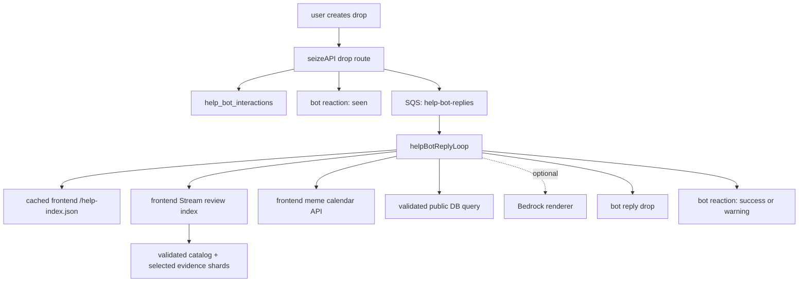
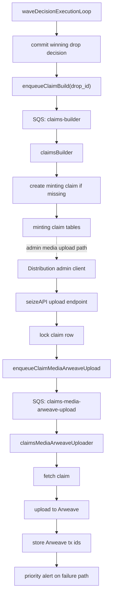

# Architecture Overview

This backend is a serverless, database-centered TypeScript system for 6529.io.
The main runtime pieces are:

- A single public API Lambda (`seizeAPI`) running Express.
- Many independently deployed background Lambdas for chain ingestion, derived data, media processing, notifications, and operations.
- MySQL as the source of truth.
- Redis as shared cache, rate-limit, dedupe, and short-lived coordination storage.
- SQS and EventBridge as the async execution fabric.
- S3, CloudFront, Arweave, Ethereum/RPC providers, Firebase, Sentry, CloudWatch, Discord, and SNS around the core.

## High-Level Diagram

This is the compact map. Lambda boxes are intentionally just service names; trigger type is shown by the surrounding group or the queue/topic feeding the Lambda. The tables below carry the longer descriptions so the diagram stays readable.

```mermaid
%%{init: {"flowchart": {"nodeSpacing": 24, "rankSpacing": 58, "curve": "basis"}} }%%
flowchart TD
  Client["Client / web app"] --> APIGW["API Gateway<br/>HTTP + WebSocket"]
  APIGW --> SeizeAPI["seizeAPI"]

  SeizeAPI --> Auth["auth, routes,<br/>WebSockets, OpenAPI"]
  SeizeAPI --> ReadPool["API read pool"]
  SeizeAPI --> WritePool["API write pool"]
  ReadPool --> MySQL["MySQL / RDS"]
  WritePool --> MySQL
  SeizeAPI --> Redis["Redis"]
  SeizeAPI --> S3["public S3 media bucket"]
  SeizeAPI --> DropMediaIngestS3["private drop media ingest S3 bucket"]
  SeizeAPI --> MediaResolver["Decentralized media resolver<br/>native URI + gateway URL mapping"]
  SeizeAPI --> AiRpc["AI / RPC / webhooks"]

  subgraph Scheduled["Scheduled Lambdas (EventBridge)"]
    direction TB
    EventBridge["EventBridge schedules"] --> NftsLoop["nftsLoop"]
    NftsLoop ~~~ TransactionsLoop["transactionsLoop"]
    TransactionsLoop ~~~ NftOwnersLoop["nftOwnersLoop"]
    NftOwnersLoop ~~~ NftHistoryLoop["nftHistoryLoop"]
    NftHistoryLoop ~~~ DelegationsLoop["delegationsLoop"]
    DelegationsLoop ~~~ NextgenContractLoop["nextgenContractLoop"]
    NextgenContractLoop ~~~ NextgenMetadataLoop["nextgenMetadataLoop"]
    NextgenMetadataLoop ~~~ ExternalSnapshotLoop["externalCollectionSnapshottingLoop"]
    ExternalSnapshotLoop ~~~ ExternalLiveTailLoop["externalCollectionLiveTailingLoop"]
    ExternalLiveTailLoop ~~~ TransactionsProcessingLoop["transactionsProcessingLoop"]
    TransactionsProcessingLoop ~~~ TdhLoop["tdhLoop"]
    TdhLoop ~~~ TdhHistoryLoop["tdhHistoryLoop"]
    TdhHistoryLoop ~~~ OwnersBalancesLoop["ownersBalancesLoop"]
    OwnersBalancesLoop ~~~ AggregatedActivityLoop["aggregatedActivityLoop"]
    AggregatedActivityLoop ~~~ MarketStatsLoop["marketStatsLoop"]
    MarketStatsLoop ~~~ RateEventProcessingLoop["rateEventProcessingLoop"]
    RateEventProcessingLoop ~~~ WaveDecisionExecutionLoop["waveDecisionExecutionLoop"]
    WaveDecisionExecutionLoop ~~~ WaveLeaderboardSnapshotterLoop["waveLeaderboardSnapshotterLoop"]
    WaveLeaderboardSnapshotterLoop ~~~ WaveDropMetricsRefreshLoop["waveDropMetricsRefreshLoop"]
    WaveDropMetricsRefreshLoop ~~~ WaveScoreRefreshLoop["waveScoreRefreshLoop"]
    WaveScoreRefreshLoop ~~~ XTdhGrantsReviewerLoop["xTdhGrantsReviewerLoop"]
    XTdhGrantsReviewerLoop ~~~ SubscriptionsDaily["subscriptionsDaily"]
    SubscriptionsDaily ~~~ SubscriptionCoverageReconciliationLoop["subscriptionCoverageReconciliationLoop (subscriptionsDaily stack)"]
    SubscriptionCoverageReconciliationLoop ~~~ SubscriptionsTopUpLoop["subscriptionsTopUpLoop"]
    SubscriptionsTopUpLoop ~~~ DiscoverEnsLoop["discoverEnsLoop"]
    DiscoverEnsLoop ~~~ RefreshEnsLoop["refreshEnsLoop"]
    RefreshEnsLoop ~~~ EthPriceLoop["ethPriceLoop"]
    EthPriceLoop ~~~ MintAnnouncementsLoop["mintAnnouncementsLoop"]
    MintAnnouncementsLoop ~~~ ArtCurationNftWatchLoop["artCurationNftWatchLoop"]
    ArtCurationNftWatchLoop ~~~ RememesLoop["rememesLoop"]
    RememesLoop ~~~ RoyaltiesLoop["royaltiesLoop"]
    RoyaltiesLoop ~~~ DbDumpsDaily["dbDumpsDaily"]
    DbDumpsDaily ~~~ NextgenMediaUploader["nextgenMediaUploader"]
    NextgenMediaUploader ~~~ NextgenMediaImageResolutions["nextgenMediaImageResolutions"]
  end

  subgraph Queues["Queue and topic triggered Lambdas"]
    direction TB
    WaveDecisionExecutionLoop --> ClaimsBuilderQueue["SQS: claims-builder"] --> ClaimsBuilder["claimsBuilder"]
    SeizeAPI --> ClaimsMediaQueue["SQS: claims-media-arweave-upload"] --> ClaimsMediaArweaveUploader["claimsMediaArweaveUploader"]
    NftsLoop --> S3UploaderQueue["SQS: s3-uploader-jobs"] --> S3Uploader["s3Uploader"]
    SeizeAPI --> AttachOrchestrationQueue["SQS: attachments-orchestration"] --> AttachmentsOrchestrator["attachmentsOrchestrator"]
    AttachmentsOrchestrator --> AttachProcessingQueue["SQS: attachments-processing"] --> AttachmentsProcessor["attachmentsProcessor"]
    SeizeAPI --> DropMediaSanitizerQueue["SQS: drop-media-sanitizer"] --> DropMediaSanitizer["dropMediaSanitizer"]
    SeizeAPI --> NftLinkRefreshQueue["SQS: nft-link-refreshes"] --> NftLinkRefresherLoop["nftLinkRefresherLoop"]
    NftLinkRefresherLoop --> NftLinkPreviewQueue["SQS: nft-link-media-previews"] --> NftLinkMediaPreviewLoop["nftLinkMediaPreviewLoop"]
    SeizeAPI --> PushQueue["SQS: firebase-push-notifications"] --> PushNotificationsHandler["pushNotificationsHandler"]
    SeizeAPI --> HelpBotQueue["SQS: help-bot-replies"] --> HelpBotReplyLoop["helpBotReplyLoop"]
    SeizeAPI --> ReleaseNotesQueue["SQS: release-note-generation"] --> ReleaseNotesGenerationLoop["releaseNotesGenerationLoop"]
    SeizeAPI --> WaveDropMetricsDirtyQueue["SQS: wave-drop-metrics-refresh-dirty.fifo"] --> WaveDropMetricsRefreshLoop
    SeizeAPI --> WaveScoreDirtyQueue["SQS: wave-score-refresh-dirty.fifo"] --> WaveScoreRefreshLoop
    TdhLoop --> TdhDoneTopic["SNS: tdh-calculation-done.fifo"]
    TdhDoneTopic --> XTdhQueue["SQS: xtdh-start.fifo"] --> XTdhLoop["xTdhLoop"]
    XTdhLoop --> XTdhQueue
    TdhDoneTopic --> OverRatesQueue["SQS: over-rates-revocation-start.fifo"] --> OverRatesRevocationLoop["overRatesRevocationLoop"]
    TdhDoneTopic --> WaveScoreRefreshQueue["SQS: wave-score-refresh-start.fifo"] --> WaveScoreRefreshLoop["waveScoreRefreshLoop"]
  end

  subgraph RequestEventManual["Request, event, edge, SNS, and manual Lambdas"]
    direction TB
    CloudFront["CloudFront"] --> MediaResizerLoop["mediaResizerLoop"]
    CloudFront --> NextgenMediaProxyInterceptor["nextgenMediaProxyInterceptor"]
    S3 --> DropsVideoCreatedRule["S3 Object Created: drops/"] --> DropVideoConversionInvokerLoop["dropVideoConversionInvokerLoop"]
    S3 --> AttachmentObjectCreatedRule["S3 Object Created: attachments"] --> AttachmentsOrchestrator
    Operator["operator / deploy workflow"] --> DbMigrationsLoop["dbMigrationsLoop"]
    Operator --> CustomReplayLoop["customReplayLoop"]
    Operator --> PopulateHistoricConsolidatedTdh["populateHistoricConsolidatedTdh"]
    Operator --> TeamLoop["teamLoop"]
    CloudwatchTopic["SNS: cloudwatch-alarms"] --> CloudwatchAlarmsToDiscordLoop["cloudwatchAlarmsToDiscordLoop"]
  end

  BackgroundWorkers["background Lambda runtime"] --> LambdaRuntime["doInDbContext runtime"]
  DropVideoConversionInvokerLoop --> EnvOnlyRuntime["environment-only runtime"]
  LambdaRuntime --> MySQL
  LambdaRuntime --> Redis
  LambdaRuntime --> Ops["Sentry / CloudWatch / Discord"]
  EnvOnlyRuntime --> Ops

  S3Uploader --> S3
  AttachmentsProcessor --> S3
  DropMediaSanitizer --> DropMediaIngestS3
  DropMediaSanitizer --> S3
  NftLinkMediaPreviewLoop --> S3
  ClaimsMediaArweaveUploader --> Arweave["Arweave"]
  PushNotificationsHandler --> Firebase["Firebase"]
  PushNotificationsHandler -->|recipient-scoped notification invalidation| APIGW
  DropVideoConversionInvokerLoop --> MediaConvert["MediaConvert"]
```

## Lambda Inventory

### Scheduled Lambdas (EventBridge)

| Lambda                                   | Purpose                                                                                                                                                             |
| ---------------------------------------- | ------------------------------------------------------------------------------------------------------------------------------------------------------------------- |
| `nftsLoop`                               | Discover, refresh, and audit NFTs.                                                                                                                                  |
| `transactionsLoop`                       | Index MEMES, Gradients, and Meme Lab transfers.                                                                                                                     |
| `nftOwnersLoop`                          | Maintain current owner balance snapshots.                                                                                                                           |
| `nftHistoryLoop`                         | Maintain ownership history.                                                                                                                                         |
| `delegationsLoop`                        | Sync delegation.cash and consolidation data.                                                                                                                        |
| `nextgenContractLoop`                    | Index NextGen contract events.                                                                                                                                      |
| `nextgenMetadataLoop`                    | Refresh NextGen metadata.                                                                                                                                           |
| `externalCollectionSnapshottingLoop`     | Snapshot external collection ownership.                                                                                                                             |
| `externalCollectionLiveTailingLoop`      | Live-tail external collection transfers.                                                                                                                            |
| `transactionsProcessingLoop`             | Normalize raw transactions into processed state.                                                                                                                    |
| `tdhLoop`                                | Calculate TDH and publish TDH completion.                                                                                                                           |
| `tdhHistoryLoop`                         | Write historical TDH snapshots.                                                                                                                                     |
| `ownersBalancesLoop`                     | Project owner balance aggregates.                                                                                                                                   |
| `aggregatedActivityLoop`                 | Calculate activity aggregates.                                                                                                                                      |
| `marketStatsLoop`                        | Aggregate market stats for MEMES, Lab, Gradients, and NextGen.                                                                                                      |
| `rateEventProcessingLoop`                | Process DB-backed rating events.                                                                                                                                    |
| `waveDecisionExecutionLoop`              | Execute wave decisions and enqueue claim builds.                                                                                                                    |
| `waveLeaderboardSnapshotterLoop`         | Snapshot wave leaderboards.                                                                                                                                         |
| `waveDropMetricsRefreshLoop`             | Scheduled fallback that drains dirty drop metric refresh requests.                                                                                                  |
| `waveScoreRefreshLoop`                   | Scheduled fallback that drains dirty Wave Score refresh requests.                                                                                                   |
| `xTdhGrantsReviewerLoop`                 | Review xTDH grants.                                                                                                                                                 |
| `subscriptionsDaily`                     | Process daily subscription work and own the shared Serverless deployment stack for subscription reconciliation.                                                     |
| `subscriptionCoverageReconciliationLoop` | Reconcile projected subscription coverage from durable dirty keys every minute and run an hourly full sweep as a separate Lambda in the `subscriptionsDaily` stack. |
| `subscriptionsTopUpLoop`                 | Process subscription top-ups.                                                                                                                                       |
| `discoverEnsLoop`                        | Discover ENS names.                                                                                                                                                 |
| `refreshEnsLoop`                         | Refresh known ENS names.                                                                                                                                            |
| `ethPriceLoop`                           | Snapshot ETH price every five minutes.                                                                                                                              |
| `mintAnnouncementsLoop`                  | Publish mint announcements.                                                                                                                                         |
| `artCurationNftWatchLoop`                | Watch curated NFT state.                                                                                                                                            |
| `rememesLoop`                            | Refresh rememes S3 files and metadata.                                                                                                                              |
| `royaltiesLoop`                          | Refresh royalty state.                                                                                                                                              |
| `dbDumpsDaily`                           | Create daily database dumps.                                                                                                                                        |
| `nextgenMediaUploader`                   | Upload NextGen media.                                                                                                                                               |
| `nextgenMediaImageResolutions`           | Generate NextGen image resolutions.                                                                                                                                 |
| `releaseBusV2Reconciler`                 | Claim and reconcile exact Simple Release Bus v2 trains.                                                                                                             |
| `releaseBusCleaner`                      | Remove expired temporary v2 release branches that no active train owns.                                                                                             |

`transactionsLoop` receipt verification fails closed and raises per-function
error alarms. See the [transactions ingestion runbook](transactions-loop-ingestion-runbook.md)
for alert triage and recovery.

### Triggered Lambdas

| Lambda                           | Trigger                                                                                                                            | Purpose                                                                                                                     |
| -------------------------------- | ---------------------------------------------------------------------------------------------------------------------------------- | --------------------------------------------------------------------------------------------------------------------------- |
| `api` / `seizeAPI`               | API Gateway HTTP/WebSocket                                                                                                         | Public REST API and WebSocket boundary.                                                                                     |
| `claimsBuilder`                  | SQS `claims-builder`                                                                                                               | Build minting claims from winning drops.                                                                                    |
| `claimsMediaArweaveUploader`     | SQS `claims-media-arweave-upload`                                                                                                  | Upload claim media and metadata to Arweave.                                                                                 |
| `s3Uploader`                     | SQS `s3-uploader-jobs`                                                                                                             | Mirror, compress, and upload NFT media.                                                                                     |
| `attachmentsOrchestrator`        | SQS `attachments-orchestration` and S3 object-created event                                                                        | Find uploaded attachment objects, retry, and enqueue processing.                                                            |
| `attachmentsProcessor`           | SQS `attachments-processing`                                                                                                       | Scan/process attachments.                                                                                                   |
| `dropMediaSanitizer`             | SQS `drop-media-sanitizer`                                                                                                         | Strip metadata from private-ingest drop/wave image uploads and publish sanitized originals.                                 |
| `nftLinkRefresherLoop`           | SQS `nft-link-refreshes`                                                                                                           | Resolve external NFT links.                                                                                                 |
| `nftLinkMediaPreviewLoop`        | SQS `nft-link-media-previews`                                                                                                      | Generate media previews for NFT links.                                                                                      |
| `pushNotificationsHandler`       | SQS `firebase-push-notifications`                                                                                                  | Deliver Firebase pushes and recipient-scoped WebSocket notification invalidations after notification rows are durable.      |
| `helpBotReplyLoop`               | SQS `help-bot-replies`                                                                                                             | Answer `@help6529` mentions and direct follow-ups to bot replies.                                                           |
| `releaseNotesGenerationLoop`     | SQS `release-note-generation`                                                                                                      | Publish production Backend, Frontend, and Desktop release notes as `ci6529`.                                                |
| `waveDropMetricsRefreshLoop`     | SQS `wave-drop-metrics-refresh-dirty.fifo`; EventBridge fallback                                                                   | Repair materialized wave/dropper drop counts and latest-drop timestamps after drop deletes.                                 |
| `xTdhLoop`                       | SNS `tdh-calculation-done.fifo` via SQS `xtdh-start.fifo`; self-queued stats phase                                                 | Recalculate the xTDH universe after TDH finishes, then rebuild and publish xTDH stats in a follow-up queue message.         |
| `overRatesRevocationLoop`        | SNS `tdh-calculation-done.fifo` via SQS `over-rates-revocation-start.fifo`                                                         | Revoke over-rates after TDH changes.                                                                                        |
| `waveScoreRefreshLoop`           | SNS `tdh-calculation-done.fifo` via SQS `wave-score-refresh-start.fifo`; SQS `wave-score-refresh-dirty.fifo`; EventBridge fallback | Refresh materialized wave REP and Wave Score discovery fields after TDH changes or wave/drop/rating/subscription mutations. |
| `mediaResizerLoop`               | CloudFront/request path                                                                                                            | Resize images on demand.                                                                                                    |
| `nextgenMediaProxyInterceptor`   | Lambda@Edge / CloudFront request                                                                                                   | Provide NextGen metadata fallback.                                                                                          |
| `dropVideoConversionInvokerLoop` | S3 object-created event for `drops/`                                                                                               | Invoke MediaConvert for uploaded drop videos.                                                                               |
| `cloudwatchAlarmsToDiscordLoop`  | SNS `cloudwatch-alarms`                                                                                                            | Post CloudWatch alarms to Discord.                                                                                          |

### Manual Or One-Off Lambdas

| Lambda                            | Purpose                                                           |
| --------------------------------- | ----------------------------------------------------------------- |
| `dbMigrationsLoop`                | TypeORM entity synchronization, usually run from deploy workflow. |
| `customReplayLoop`                | Controlled replay job.                                            |
| `populateHistoricConsolidatedTdh` | Historic consolidated TDH backfill.                               |
| `teamLoop`                        | Team CSV and Arweave upload.                                      |

## Runtime Shape

The API Lambda is the public synchronous boundary. It initializes local config or AWS secrets, opens MySQL read/write pools, initializes Redis, configures Passport JWT authentication, registers all routers, and then serves HTTP through `serverless-http`. The same handler also branches on API Gateway WebSocket route keys for `$connect`, `$disconnect`, and `$default` messages.

Background Lambdas that read or write application state use a shared `doInDbContext` wrapper. That wrapper prepares environment/secrets, initializes TypeORM-backed DB access, initializes Redis, runs the job, then disconnects. The `dropVideoConversionInvokerLoop` is intentionally environment-only: it loads config/secrets, filters the S3 object key, and invokes MediaConvert without opening MySQL or Redis connections.

MySQL is the integration contract between nearly all modules. API routes, scheduled pollers, queue workers, and derived-data loops all read and write shared tables. Redis is secondary and mostly disposable: API request cache, rate limiting, webhook dedupe, locks, and selected feature caches can fail open or be repopulated from MySQL.

## Main Data Flows

1. Client requests enter through API Gateway and land in `seizeAPI`.
2. The API validates input, authenticates JWT or anonymous context, reads/writes MySQL, uses Redis for cache/rate limiting, and sometimes publishes SQS work.
3. Scheduled ingestion Lambdas poll Ethereum/RPC/Alchemy/Etherscan, normalize chain state, and write canonical rows into MySQL.
4. Derived-data Lambdas read canonical tables and write projections such as TDH, owner balances, aggregated activity, wave decisions, leaderboards, metrics, and reputation aggregates.
5. SQS workers handle slow or retryable side effects through named queues: claim building, claim media Arweave uploads, S3 media mirroring, attachment orchestration/processing, NFT link resolution/previews, xTDH recalculation, Wave Score dirty refreshes, and notification delivery through Firebase plus recipient-scoped WebSocket invalidations.
6. S3 and CloudFront serve media. Drop and wave image uploads can first land in a private ingest bucket, then `dropMediaSanitizer` strips metadata and publishes the sanitized full-size original to the public bucket before CloudFront/resizer paths serve it. Other specialized media paths include on-demand resizing, video conversion, and NextGen metadata placeholder interception.
7. Operational signals flow to Sentry, CloudWatch alarms, Discord, and SNS.

CI deploy and WEB E2E signals enter the API through the signed pipeline-alert
route. The API renders and posts the deploy drop, then retains successful WEB
deploy reply targets in Redis by deploy run ID and optional Release Bus train
ID. Terminal E2E signals carry those durable identities back to the API; only
an unambiguous match becomes a drop reply, while missing or inconsistent state
falls back to a standalone result. Workflows never own Seize drop IDs. See
[CI Pipeline Alerts](./ci-pipeline-alerts.md) for the request, formatting,
retention, rerun, and rollout contract.

Notification invalidation is emitted only after the push worker loads durable notification rows. It intentionally remains independent from mobile push registration, mute settings, and delivery success because those controls affect Firebase delivery only; the durable row remains visible through the authenticated REST feed. Duplicate SQS deliveries may repeat this idempotent invalidation without duplicating notification data.

WebSocket notification subscription replacement is transactional. New connections, re-authentication, and identity resyncs each have a one-percent chance of running bounded, deterministic cleanup of expired and orphaned subscription rows, so cleanup capacity follows subscription churn without putting the sweep on every hot-path call. The repository identity update method is the sole write path for `ws_connections.identity_id` and keeps the primary subscription reset coupled to re-authentication.

## API Boundary

The API is organized by domain routers under `src/api-serverless/src`. The OpenAPI file defines the public contract and generated models. Legacy routes are wired manually, while newer OpenAPI operations can opt into generated route wiring through `x-6529-router` and thin domain handlers.

Waves have an additive competition read boundary under `/v3/waves`. A wave is
the chat/visibility hub and owns zero, one, or many competition resources. The
competition service resolves each resource through either the immutable legacy
adapter or the native competition repositories; it never infers an
"active/current competition." Existing unversioned and v2 wave/drop GETs remain
permanent façades over the original legacy wave configuration. A future native
hub therefore remains a contract-valid `CHAT` wave to those clients, and adding
another competition cannot change a legacy Rank/Approve projection.

Competition storage and execution ownership are explicit per competition.
Legacy-primary mappings keep existing decision and leaderboard workers active;
native execution additionally requires its global kill switch and is disabled
by default. `dbMigrationsLoop` creates the additive competition/read-model
tables and backfills stable legacy mappings before API or worker deployments.
The independent unified-read, native-write, native-execution, native-hub, and
sampled-shadow flags default off. Shadow observations persist only canonical
hashes and identifiers, never vote/signature/private payloads.
Operational deployment, verification, and rollback are documented in the
[competition read boundary runbook](./competition-read-boundary-runbook.md).

Important API responsibilities:

- Authentication and refresh-token flows. Legacy wallet auth keeps `/auth/nonce`,
  `/auth/login`, and `/auth/redeem-refresh-token`; wallet auth session v2 uses
  separate endpoints such as `/auth/session-nonce`,
  `/auth/session-login`, `/auth/session-refresh`, and `/auth/session-logout`.
  Web session-v2 challenges are canonical ERC-4361 SIWE messages whose scheme,
  domain, and URI are bound to the exact normalized first-party request
  `Origin`. They are carried in short-lived, server-signed object envelopes
  bound to the allowlisted request API host. Native and desktop session-v2
  challenges retain the existing structured-message format and are explicitly
  requested with `client_type=native` or `client_type=desktop`. Both formats
  complete all semantic and wallet-signature checks before a final atomic nonce
  consumption. The full auth contract is documented in
  [Wallet Authentication](auth/wallet-auth.md).
- Public read APIs for NFTs, TDH, waves, drops, profiles, community metrics,
  subscriptions, and notifications. Wallet distribution allocation reads
  combine Phase 0–2 distribution rows with Public subscription airdrops, while
  returning card-level publication state without exposing the full Public
  subscription list. They intentionally accept any wallet address without
  authentication because distribution plans are public and the home page must
  render before wallet authentication. Responses use a 60-second route cache
  to limit repeated database reads while keeping publication changes timely.
- Paginated group-member inspection uses `GET /community-members/top` for a
  saved group and supports parameterized handle or wallet search. Authenticated
  `POST /groups/preview-members` evaluates an unsaved group description through
  the same membership SQL without creating a group, identity group, or other
  persistent record. Draft identity-address and NFT-token criteria remain bind
  parameters, and results reflect the current indexed metrics and ownership
  state.
- Wave mention autocomplete under `/v2/waves/{waveId}/mention-search`, which
  derives visibility eligibility from a persisted wave, and the authenticated
  `/v2/waves/mention-search` draft endpoint, which applies the selected
  visibility group before the wave exists. Both perform indexed handle-prefix
  matching and return a minimal profile result ranked by level.
- Global REP category analytics under `/rep/categories/{category}`, backed by current non-zero REP rating rows for category overview, giver-recipient pairings, recipient rankings, and giver rankings.
- Public OG metadata inputs for profile, wave, and drop link previews under `/og-metadata`.
- Public profile-native CMS primary package lookup under
  `/profile-cms/{handle}/primary`, returning the published production-safe CMS
  V1 package envelope used by `/{handle}/index.html`; draft, failed, fixture,
  and missing primary packages return 404.
- Authenticated profile-native CMS publish hardening under `/profile-cms`,
  including EIP-712 publish intent verification, canonical IPFS/Arweave receipt
  checks, rollback/archive endpoints, and package export data for future
  standalone renderers and mirrors.
- Authenticated profile-native CMS wallet gallery snapshots under
  `/profile-cms/wallet-gallery/snapshot`, gated by
  `FEATURE_PROFILE_CMS_WALLET_GALLERY`, reading current indexed NFT ownership
  and normalized media from MySQL for deterministic gallery generation.
- Profile-native CMS BYO-agent affordances under `/profile-cms/agent` and
  `/profile-cms/packages/{id}/agent`, including a public schema bundle,
  read-only source packets that separate facts, author copy, derived metadata,
  and validation diagnostics, and authenticated draft patch validation that
  dry-runs agent proposals without applying changes or bypassing publish
  signing/storage authority.
- Public decentralized media resolution under `/media/resolve`, which maps
  native `ipfs://`, `ipns://`, and `ar://` references plus recognized gateway
  URLs to canonical native URIs, `media.6529.io` resolver URLs, and explicit
  external fallback URLs. This v1 API does not proxy media bytes.
- Authenticated direct-message unread summary under `/dm-drops/unread`,
  retaining the lightweight `{ count }` contract for legacy clients, plus the
  authoritative per-conversation state under `/dm-drops/unread/snapshot` for
  clients that synchronize unread state through WebSockets.
- Authenticated social writes: drops, votes, reactions, curations, subscriptions, groups, proxies, profile CMS package drafts/publish actions, minting claims, and push settings.
- `@help6529` trigger detection after drop creation. The API writes a durable `help_bot_interactions` row, reacts with the bot's seen marker, and enqueues the reply worker when the `help6529` profile exists.
- Upload preparation and multipart completion for drop media, wave media, distribution photos, and attachments. When `DROP_MEDIA_SANITIZE_IMAGES=true`, drop/wave image multipart uploads complete into private ingest storage, return `media_status=processing`, and publish a `DROP_UPDATE` websocket event with reason `MEDIA_STATUS` after the sanitizer marks the media ready or failed.
- WebSocket connection registration and real-time wave-related messages.
- Operational endpoints such as health, docs, RPC/proxy routes, webhooks, and deploy-related routes.

Wave rows can be top-level waves or subwaves through the nullable `parent_wave_id` column. Top-level wave discovery endpoints exclude subwaves, while `/waves/{id}/subwaves` lists child wave overviews. Subwave read access also requires the parent wave to be visible, and deleting a parent wave cascades through the API service to delete its subwaves.

Wave writes enforce that every active Drop, Vote, Chat, and Admin membership is
contained by the Wave View membership. The generated
`POST /wave-group-validation` boundary exposes the same privacy-preserving
preflight result to clients as failing scope names only. Dynamic group
membership is evaluated with one batched anti-join query, group-version swaps
are checked before replacing a Wave-referenced group, and runtime privilege
flags remain intersected with View eligibility if group criteria later drift.

The waves v2 read boundary keeps timeline, reply-thread, and curation feeds as separate contracts. `/v2/waves/{id}/drops` returns the wave timeline feed, `/v2/drops/{id}/replies` returns the reply thread for a root drop after resolving its owning visible wave, and `/v2/waves/{id}/curations/{curation_id}/drops` returns drops for one wave curation.

For the wave configured by `MAIN_STAGE_WAVE_ID`, v2 winning-drop responses can
also expose an optional Meme card ID through their submission context. The
public `/meme-cards/{id}/drop` lookup provides the reverse link. Both directions
are limited to configured Main Stage winner rows; unrelated waves and legacy
drop responses are unchanged.

The waves v2 boundary also exposes `/v2/official-waves`, backed by the `official_waves` selector table. It returns readable `ApiWaveOverview` rows for listed wave ids and skips stale entries whose wave row no longer exists.

Wave creators and wave admins can manage arbitrary wave metadata pairs through `/v2/waves/{id}/metadata`. Read access follows the same wave visibility rules as other wave v2 reads, while writes are restricted to the creator or members of the wave admin group. Metadata is stored in `waves_metadatas`, keyed by wave id and metadata key.

Wave creators and wave admins can attach one inline poll to a chat drop through the drop creation API. Poll definitions, options, and votes are stored in `drop_polls`, `drop_poll_options`, and `drop_poll_votes`; poll reads follow existing drop and wave visibility rules, include the authenticated profile's selected option numbers, and poll votes replace the acting profile's previous answers for that poll. A poll vote also creates the normal notification and Firebase push notification path for the drop author with the voter identity and selected option labels.

Wave poll listing is exposed through `/v2/waves/{id}/polls`, returning paginated `ApiDropV2` data for drops that have inline polls, ordered by drop `created_at` descending by default, with optional `sort=closing_time` and `state=OPEN|CLOSED` filtering.

## Database Boundary

There are two DB access modes:

- API mode uses mysql read/write pools. Simple SQL classification routes `INSERT`, `UPDATE`, `DELETE`, and `REPLACE` to the write pool; other queries default to the read pool unless forced.
- Loop mode uses TypeORM initialization and the shared `SqlExecutor` abstraction. Schema ownership is entities-first: add or update TypeORM entity classes, export them from `src/entities/entities.ts`, and let `dbMigrationsLoop` run entity synchronization. Do not create SQL migrations for schema changes unless explicitly requested; migrations are reserved for one-off data work or views.

The core architectural choice is that MySQL is both the system of record and the internal integration layer. This keeps the system understandable, but it makes table contracts, migrations, backfills, indexes, and worker idempotency especially important.

Main Stage Meme-card associations are stored separately in
`meme_card_drop_mappings`, with one unique row per Meme card ID and drop ID.
`dbMigrationsLoop` backfills the table only after minting-claim anchors prove a
single sequential winner-to-card offset, and aborts instead of guessing when
the anchors or winner sequence are inconsistent. `claimsBuilder` adds future
mappings in the same transaction as claim creation after confirming that the
drop is a winner in the configured Main Stage wave.

Profile-native CMS packages are stored in `profile_cms_packages`. The table
keeps the complete CMS V1 package JSON, indexed profile/package/version/hash
fields, publication state, primary-package flags, validation results, and
storage receipt indexes for IPFS, Arweave, S3, and fixture receipts. The API
publish path validates CMS V1 semantics, enforces the submitted payload and
package hashes, rejects fixture signatures/storage for production publish,
verifies EIP-712 publish intent, requires one canonical IPFS or Arweave receipt,
consumes the verified typed-data hash to prevent publish-intent replay, and
supersedes the previous primary package in one transaction.

Profile CMS pointer history is stored in `profile_cms_pointer_events`. Publish,
set-primary, supersede, rollback, and archive events keep package hashes,
previous-primary links, actor profile ids, signature metadata, and canonical
storage receipts. `event_sequence` preserves logical ordering for events written
in the same millisecond so the primary pointer history can be reconstructed and
exported for future mirrors. Consumed publish intent hashes are stored in
`profile_cms_publish_signatures`.

Profile CMS wallet gallery snapshots are read-only API projections over
`nft_owners`, `ens`, `nfts`, `nfts_meme_lab`, and `nextgen_tokens`. They do not
create schema, run migrations, enqueue indexers, or fetch chain/metadata data
live. Request-side asset/contract exclusions are applied in the API service and
reported in the response for generator auditability.

Profile privacy and notification preferences are stored in
`profile_preferences`, keyed by profile id. Missing rows preserve the legacy
defaults: anyone may start a new direct-message conversation, all notification
categories are enabled, and the notification level is `ALL`. Preference PUTs
update only the supplied columns in one transaction, so concurrent partial
updates do not restore unrelated stale values. New direct-message admission
locks stable recipient profile rows and rechecks every recipient inside the
same transaction that creates the group. Preference updates take the same
profile-row lock before writing, which serializes first-time preference changes
without creating default preference rows as a side effect of another user's DM;
existing exact conversations bypass that admission check. Notification writers
consult the same table before the in-app row is created. When preference
filtering succeeds, suppressed notifications are not inserted and cannot reach
the downstream push pipeline. If preference filtering fails, notification
delivery fails open and the unfiltered notifications are inserted. The
`direct_messages` API field intentionally represents the
combined user-facing “Direct messages and wave activity” category, including
new-wave, all-drops subscription, and priority-alert causes.

Roll out this table and its dependent workloads in this order:

1. `dbMigrationsLoop` creates `profile_preferences` with legacy-compatible
   defaults.
2. Deploy `api` for preference endpoints, direct-message admission, and API
   notification writers.
3. Deploy the `subscriptionsDaily` stack (including
   `subscriptionCoverageReconciliationLoop`) and `pushNotificationsHandler`;
   these may proceed in parallel after the schema and API are live.

Wallet auth session v2 state is stored in `wallet_auth_sessions` and one-time
connection share state is stored in `wallet_connection_shares`. Web sessions
persist the signed domain and normalized client origin so refresh and logout
requests can be bound to the same browser origin that created the session. Web
clients receive a compatibility `6529_session` cookie plus address-scoped
session cookies so multi-account refresh/logout and connection sharing can bind
to the requested active wallet instead of the last wallet that wrote the
compatibility cookie. Native sessions store refresh-token hashes instead of
browser-origin metadata.

## Async Processing

There are three async patterns:

- EventBridge scheduled pollers: periodic ingestion, aggregation, refresh, and operational jobs.
- SQS workers: retryable side effects and heavier processing.
- DB-backed event processing: the `events` table stores processable events, and `rateEventProcessingLoop` locks and dispatches them to listener implementations.

Most long-running scheduled jobs have reserved concurrency set low, usually `1`, which protects shared tables from concurrent writer races. SQS workers use queue visibility timeouts, DLQs, and batch failure reporting where configured.

Production CI notifications also feed the release-note queue; staging notifications never carry release-note fields. The API first posts the normal CI status drop. For a successful production notification with an allowlisted repository prompt path, it accepts either the legacy single release group or a v2 array of PR-scoped groups and enqueues one message per group. Each group contains its merged PR number and complete canonical service set, so one service deployment may update multiple overlapping PR groups. Frontend and Desktop publishes are one-service groups. Each successful backend service deploy records its workflow run under the merged PR number; runs may use different descendant SHAs. Every applicable successful service persists the group-level publish request, so no particular service or completion order owns finalization. The canonical completed-service set gates generation. Redis retains that group coordination and supplies a short-lived publication mutex, while MySQL owns durable run-range publication state.

`releaseNotesGenerationLoop` validates the completed successful GitHub run, then freezes its baseline in `release_note_publications` from the per-workflow cursor in `release_note_stream_states`. Only an empty stream performs workflow-history bootstrap: it requests newest-first pages of 100 runs without GitHub's broken status, conclusion, or branch filters, validates production status, workflow identity, and branch locally, and fails closed after 1,000 candidates. Completing all parts, or determining that the range contains no PRs, advances the stream cursor in the same transaction that completes the publication. A partial or failed publication leaves the cursor unchanged and blocks later runs in that stream until it resumes. The worker loads the reviewed prompt from the deployed repository SHA and calls Amazon Bedrock using `RELEASE_NOTES_BEDROCK_MODEL_ID` or the Claude Sonnet 4.5 US geo inference profile by default. A Bedrock system instruction treats the tagged release context as untrusted data and rejects instructions embedded in pull requests, commits, or filenames. Frontend PR discovery follows only first-parent mainline commits between production SHAs, while contributor enrichment still loads every commit author and committer from each selected PR. Backend and Frontend notes resolve configured GitHub contributors to 6529 profile mentions and render deterministic repository-specific headings and service links. Genuine large releases are published in resumable groups of at most 20 PRs, with a distinct deterministic metadata id for every part. Desktop notes are requested only by the production `Publish` flow after its S3 download pages exist. They retain the Core first-parent change history so imported Frontend history is not summarized twice and resolve the exact Frontend release-note drop from the renderer-source SHA. New release drops carry repository, SHA, run, and deployment metadata; historical Frontend notes are matched only when their content contains the exact full commit URL. Desktop output has a deterministic heading, Frontend release link, and platform download links around compact model-generated user-facing bullets, with no PR or contributor lines.

Deploy `dbMigrationsLoop` first so TypeORM creates the durable release-note tables, then deploy `releaseNotesGenerationLoop`, which depends on those tables.

All notes publish to `CI_RELEASES_WAVE_ID` as the profile configured by `CI_PIPELINES_BOT_PROFILE_ID`. Each published drop or multi-part batch carries a deterministic release-note metadata id. The worker reconciles those drop receipts with `next_part`, so a crash after drop creation but before the publication progress update still resumes without duplicating the part. Redis is required; PR-scoped group, publish-request, and dedupe state is retained for 7 days, while MySQL remains the durable publication and stream authority. The processing lock lasts four minutes, shorter than the five-minute SQS visibility timeout, uses an owner token for release, and lock contention fails the invocation so SQS retains the message. Before starting another part, the worker leaves a 45-second Lambda budget and retries cleanly instead of relying on the three-minute hard timeout. A failed Desktop queue handoff immediately posts a normal production CI failure with the shared 🚨 heading and `@devs6529` mention. Deterministic queued failures post that same class of alert to `CI_PIPELINES_PROD_WAVE_ID`, report to Sentry, and stop retrying once the alert succeeds. Transient Desktop failures retain three SQS retries and post the terminal alert on attempt four; an alert-delivery failure uses the fifth receive to fail closed into the DLQ. Transient Backend and Frontend failures use four SQS retries, post the terminal production alert on attempt five, and then move to the DLQ. Malformed messages and GitHub run-metadata mismatches that cannot supply trusted run metadata are reported to Sentry and drained without attempting a CI alert.

Wave Score refreshes use a hybrid DB-backed/SQS pattern. Request-path mutations write `wave_score_refresh_requests` rows inside the same primary-DB transaction as the drop, rating, or subscription change, then publish a small wakeup message to `wave-score-refresh-dirty.fifo` after commit. `waveScoreRefreshLoop` drains dirty rows from the write pool, recalculates scores, and deletes a row only if its selected `(wave_id, dirty_at)` version still matches, so a wave dirtied again during processing remains queued. A one-minute EventBridge fallback invokes the same dirty drain in case enqueueing fails after the transaction commits.

Wave drop metric repairs use the same DB-backed/SQS pattern. Drop deletes apply a bounded in-transaction counter decrement, write `wave_drop_metrics_refresh_requests`, and publish to `wave-drop-metrics-refresh-dirty.fifo` after commit. `waveDropMetricsRefreshLoop` drains from the write pool and runs the full wave/dropper metric reconciliation outside the API path, with an EventBridge fallback for missed wakeups.

Subscription coverage uses a DB-backed scheduled reconciliation pattern without
a cross-service dirty-event queue. Top-up, redemption, subscription
preference/selection, daily finalization, and consolidated eligibility writes
make a best-effort upsert into `subscription_coverage_refresh_requests`; this
bookkeeping never runs forecasts or creates notifications in those critical
paths. Notification delivery still uses the existing post-commit SQS-backed
push pipeline.
`subscriptionCoverageReconciliationLoop` is a separate Lambda function in the
existing allowlisted `subscriptionsDaily` Serverless stack. Deploying that unit
updates both handlers and verifies both Lambda versions; its release-bus
dependencies place the stack after schema, API, push, top-up, transaction, and
owner-balance prerequisites. The function drains versioned dirty rows every
minute and performs an hourly bounded full sweep to cover projected calendar
changes, clock boundaries, and missed dirty writes. It reads subscription
balances as decimal strings, derives demonstrated intent only from normalized
balance, mode, top-up, intended-subscription, final-subscription, and redeemed
rows, and uses a coverage-specific eligibility read where zero is meaningful.
The shared schedule provider consumes the canonical frontend Meme calendar API,
uses `mint_start` as a projected instant, caches one bounded horizon in memory,
and never treats `mint_start` as an operational top-up deadline. It selects the
calendar host from the explicit coverage environment or the Secrets
Manager-provided `NODE_ENV` and fails closed when neither is authoritative. A
live `/next` response is backfilled to retain the configured number of future
drops. Failure or malformed data for a later token truncates the forecast to the
contiguous valid prefix; failures are cached briefly to bound retry load, while
successful cache TTLs start only after the calendar fetch completes.

Alert transitions are serialized through a row lock in
`subscription_coverage_alert_states`. The current alert state and actorless
identity-notification row are advanced in one transaction, and push IDs are
enqueued only after commit. Missing alert state is baselined without sending by
default; neutral/recovered states clear notification eligibility, and unchanged
material risk state deduplicates retries and skips unnecessary row writes.
Notifications are routed only
when a consolidation key joins to exactly one canonical profile. The
reconciliation Lambda has reserved concurrency one, isolates per-key failures,
and logs aggregate status/notification counts without addresses, consolidation
keys, or balances.

Normal rollout persists alert baselines and enables future transition
notifications and eligible pushes. The no-blast guarantee comes from suppressing
every missing-state first observation; initial critical alerts remain disabled
unless `SUBSCRIPTION_COVERAGE_NOTIFY_INITIAL_CRITICAL=true`.
`FEATURE_SUBSCRIPTION_COVERAGE_NOTIFICATIONS=false` and
`SUBSCRIPTION_COVERAGE_PUSH_ENABLED=false` are independent kill switches.
`SUBSCRIPTION_COVERAGE_DRY_RUN=true` performs aggregate evaluation without
changing alert or dirty state, while
`SUBSCRIPTION_COVERAGE_BASELINE_ONLY=true` persists state but emits nothing.
No request cache is used for the coverage read boundary, so a confirmed top-up
or redemption can be reflected immediately.

`xTdhLoop` uses a two-phase FIFO queue flow. The TDH completion SNS topic
delivers the universe phase through `xtdh-start.fifo`; after the universe
transaction commits, the same Lambda enqueues a stats phase back to that FIFO
queue, using the same FIFO message group as the universe message when one is
available and the queue's default FIFO group otherwise. That shared message
group is what orders each universe phase before its stats phase; the SQS event
source batch size stays at `1` and Lambda reserved concurrency stays at `1` to
avoid parallel xTDH work across groups. The stats phase rebuilds the inactive
xTDH stats slot and activates it only after the rebuild succeeds; a redelivered
stats message truncates and refills the inactive slot again before activation.

## 6529 Help Bot Flow

The V1 6529 Help Bot is intentionally bounded and fast. Drop creation remains the synchronous user write. After a drop is created, the API checks for an explicit `@help6529` mention or a direct reply to a prior bot-authored reply. When matched, it inserts one `help_bot_interactions` row keyed by `trigger_drop_id`, stores `target_drop_id` for the drop that should receive reactions/replies, reacts with the bot's seen marker, and sends `{ interaction_id }` to `help-bot-replies`.

```mermaid
%%{init: {"flowchart": {"nodeSpacing": 24, "rankSpacing": 44, "curve": "basis"}} }%%
flowchart TD
  UserDrop["user creates drop"] --> DropRoute["seizeAPI drop route"]
  DropRoute --> InteractionRow["help_bot_interactions"]
  DropRoute --> SeenReaction["bot reaction: seen"]
  DropRoute --> HelpBotSqs["SQS: help-bot-replies"]
  HelpBotSqs --> HelpBotWorker["helpBotReplyLoop"]
  HelpBotWorker --> FrontendIndex["cached frontend /help-index.json"]
  HelpBotWorker --> StreamReviewIndex["frontend Stream review index"]
  StreamReviewIndex --> StreamKnowledge["validated catalog + selected evidence shards"]
  HelpBotWorker --> FrontendCalendar["frontend meme calendar API"]
  HelpBotWorker --> PublicData["validated public DB query"]
  HelpBotWorker -. optional .-> Bedrock["Bedrock renderer"]
  HelpBotWorker --> BotReply["bot reply drop"]
  HelpBotWorker --> FinalReaction["bot reaction: success or warning"]
```

Important details:

- The bot handle is hardcoded as `@help6529`; runtime resolves that handle to the current bot profile id before posting replies or reactions.
- Creating the `help6529` profile activates runtime behavior; if that handle cannot be resolved, the bot no-ops.
- The API enqueues reply jobs by the hardcoded SQS queue name `help-bot-replies`; no queue URL environment variable is required.
- The bot skips restricted-visibility waves and direct-message waves before reading parent context, creating an interaction row, queueing work, or calling Bedrock.
- The API suppresses per-user help-bot spam before queueing: after more than 5 triggers in 60 seconds by the same author, it records the interaction as `SPAM_SUPPRESSED`, reacts `⛔️` to the triggering drop, and does not post a reply.
- If a user replies to someone else's question with only `@help6529` in a public wave, the bot fetches the parent drop through the caller's normal visibility checks, uses the parent drop text as the question, and targets the parent drop for reactions and the reply.
- V1 retrieval uses the environment-matching frontend-published `/help-index.json` artifact for product knowledge: staging backend reads `https://staging.6529.io/help-index.json`, and production backend reads `https://6529.io/help-index.json`. The worker retrieves a bounded set of top matches and uses the primary record plus related facts as the answer context.
- Stream questions take a dedicated path before generic FAQ matching. The worker discovers the active corpus from `/review-data/6529-stream/index.json`, validates its version, pinned commit, reference identity, knowledge identity, catalog checksum, and selected shard checksums, then caches by version/checksum for the same bounded refresh interval. A missing, withdrawn, or invalid active corpus clears stale Stream state and falls back to the concise generic Help index record.
- Stream lookup combines exact names, signatures, selectors, topics, definition names, and source paths with weighted lexical retrieval over editorial, technical, readiness, risk, and release metadata. Bedrock receives only 4–10 deduplicated evidence records within an explicit character budget; full catalogs, shards, and raw source files are never prompt context.
- Stream prompts treat structured declaration facts as authoritative, preserve protocol/script/test classifications, keep implementation/proposal/audit/deployment states distinct, and require ambiguity disclosure for unresolved overloads. Direct replies can retain Stream scope when the previous bot answer identifies the Stream review.
- Meme Card drop timing uses the environment-matching frontend Memes calendar API (`/api/meme-calendar/next`, `/current`, and `/{id}`), which owns cadence, overrides, and mint-window calculations.
- V1 also has a bounded public-data query-intent mode for aggregate backend data questions.
- Bedrock selects a semantic public-data plan from a hardcoded catalog; Bedrock output never contains executable SQL, table names, columns, joins, or expressions.
- The backend public-data compiler validates the selected entity, operation, metric, numeric filters, and limit, then emits parameterized SQL through the shared `SqlExecutor` with the read pool forced, hard row limits, and a MySQL execution-time hint injected by backend code.
- Help index fetches use a short timeout; a cold load failure produces the technical-failure reply instead of a no-reliable-source answer.
- Bedrock rendering uses `HELP_BOT_BEDROCK_TIMEOUT_MS`, defaulting to 10 seconds, and the shared Claude Sonnet 4.5 US geo inference profile default `us.anthropic.claude-sonnet-4-5-20250929-v1:0`, with per-service env overrides loaded at Lambda startup; if rendering fails or times out, the worker falls back to deterministic wording when a reliable frontend record or public DB row exists.
- If no reliable record exists for an in-scope product question, the worker posts `I don't have enough knowledge to help you here.`, appends the global `@devs6529` mention, and changes the bot reaction to warning. The global audience is resolved from `DEVS_6529_MENTION_PROFILE_IDS` and filtered by Wave visibility.
- Obvious impossible grants, prompt-injection attempts, and private-data pokes return a short bounded no-tech-team reply instead of escalating to the no-reliable-source path.
- If a technical failure prevents answering, the worker posts the technical-failure reply and changes the bot reaction to warning.

## Drops -> Minting Claim Queue Flows

This is the concrete path where a winning drop becomes a minting claim. It is also representative of how this codebase uses SQS: synchronous code commits the durable state change first, then publishes a small message to a purpose-built queue, and the worker re-reads the full entity from MySQL before doing expensive or external work.

```mermaid
%%{init: {"flowchart": {"nodeSpacing": 24, "rankSpacing": 44, "curve": "basis"}} }%%
flowchart TD
  WaveDecision["waveDecisionExecutionLoop"] --> DecisionTx["commit winning drop decision"]
  DecisionTx --> ClaimBuildPublisher["enqueueClaimBuild(drop_id)"]
  ClaimBuildPublisher --> ClaimsBuilderSqs["SQS: claims-builder"]
  ClaimsBuilderSqs --> ClaimsBuilder["claimsBuilder"]
  ClaimsBuilder --> MintingClaimsService["create minting claim if missing"]
  MintingClaimsService --> MintingClaimsTable["minting claim tables"]

  MintingClaimsTable -. "admin media upload path" .-> AdminClient["Distribution admin client"]
  AdminClient --> UploadEndpoint["seizeAPI upload endpoint"]
  UploadEndpoint --> UploadLock["lock claim row"]
  UploadLock --> MediaPublisher["enqueueClaimMediaArweaveUpload"]
  MediaPublisher --> MediaSqs["SQS: claims-media-arweave-upload"]
  MediaSqs --> MediaUploader["claimsMediaArweaveUploader"]
  MediaUploader --> FetchClaim["fetch claim"]
  FetchClaim --> ArweaveUpload["upload to Arweave"]
  ArweaveUpload --> UpdateClaim["store Arweave tx ids"]
  UpdateClaim --> PriorityAlert["priority alert on failure path"]
```

Important details:

- `claims-builder` messages are produced by `waveDecisionExecutionLoop` after the wave decision has been committed. If enqueueing fails, the decision remains committed and a priority alert is sent.
- `claimsBuilder` consumes `{ drop_id }`, then calls the minting-claim service to create the missing claim from the winning drop.
- `claims-media-arweave-upload` messages are produced by the API only after the claim row is locked with `media_uploading=true`.
- If media upload enqueueing fails, the API tries to roll `media_uploading` back to `false`.
- `claimsMediaArweaveUploader` consumes `{ contract, claim_id }`, re-fetches the claim, uploads media and metadata to Arweave, then stores Arweave transaction ids back on the claim row.

## Deployment Model

Repository package execution has a single command boundary. Developers,
agents, CI, release preflight, and generated deployment workflows invoke the
repo-local `6529` wrapper instead of npm, npx, or Corepack directly. The
wrapper resolves the npm version pinned by the current package through
Corepack, marks authorized child processes, and keeps root, API, and
independently packaged Lambda installs on their own committed lockfiles. PATH
shims reject direct package-manager commands, while a lifecycle guard in every
package manifest also rejects installs and package scripts that bypass those
shims. Bootstrap or `direnv` exposes the command only inside this repository
tree; it does not alter the machine-wide npm installation. See
[`docs/package-commands.md`](package-commands.md) for the command contract.

Simple Release Bus v2 is an additive MySQL-backed control plane shared by the
production API and the production-region `releaseBusV2Reconciler` Lambda. Ten
versioned tables store immutable candidates, dependency edges, staging and
production trains, memberships, exact operations, environment/scheduler locks,
manifests, controls, and events. The reconciler has reserved concurrency one
and an EventBridge one-minute fallback, but it advances several internal row
transitions per invocation and exits at an actual external wait.

The v2 API exposes candidate, train, train-detail, manifest, control, lock, and
authoritative staging-state GET routes publicly under
`/deploy/release-bus-v2`. These read-only responses are uncached and expose the
same raw operational state used by `/deploy/ui/bus`, which loads as a public
read-only dashboard. They remain covered by the API's existing anonymous/IP
rate-limiting middleware. GitHub authentication is optional in the dashboard
and is used only to request operator actions. Every mutation retains its
route-specific GitHub repository-write, organization-operator,
workflow-credential, or webhook signature authorization before state can
change.
`RELEASE_BUS_V2_MODE` supports `OFF`, `STAGING`, and `PRODUCTION`, with separate
staging and production queues. Staging validation never schedules production:
an unchanged exact candidate SHA must be explicitly marked ready. An
operator-only maintenance route can transactionally yield legacy stalled
production qualifications while v2 is `OFF` with `ALL` paused, or in `STAGING`
mode with `PRODUCTION` paused. Every v2 lock must be free and a double staging
workflow/ref handshake must be stable. Recovery then owns the scheduler fence,
re-verifies every lock inside the yield transaction, and processes at most one
qualification per request so committed progress is always reported. Every
committed yield requires a follow-up drain check; only an empty recovery
response proves there are no further live qualifications to yield. A separate
operator-only maintenance route can idempotently restore a candidate's derived
staging status only when its exact repository, PR, and head are uniquely
included in the authoritative current validated staging manifest. The repair
acquires the scheduler and staging fences, rejects active trains or production
ownership, and cannot infer validation from candidate rows alone. Its
mutation-free discovery mode enumerates exact current-manifest mismatches; an
executing request must repeat the bounded repository/PR/head identities from
that report, so historical superseded heads outside the manifest stay
untouched.

The API also exposes a two-phase operator-only logical candidate
deregistration boundary. Its read-only preparation returns one complete
candidate/control/lock/staging-state row-version inventory and digest.
Execution requires both independently changeable lanes paused while `ALL`
remains unpaused, all three exact locks wholly free, every train/operation
terminal, and all backend/frontend staging/production mutation and E2E
workflows inactive. It temporarily owns all three locks and transactionally
marks candidates `DEREGISTERED` with detached rather than absent staging
presence, clears scheduling/admission/production intent, and moves the
singleton to `DETACHED_MANUAL_OWNERSHIP`. Existing dependency, train,
operation, manifest, and event history remains immutable. A detached singleton
blocks registration and claims; it can become clean main only when both exact
staging refs equal the corresponding current main bases. Matching an older
validated manifest never restores its prior candidate membership.
Terminal candidate history is byte-for-byte immutable, except that a
`SUPERSEDED` row with the exact deleted-branch event and retained production
request/staging evidence is still active intent because the reconciler can
restore it; deregistration must consume that narrow recoverable case.
These additive values fit the existing varchar widths and require no database
migration. Execution is forbidden during mixed API/reconciler runtime; both
lane controls remain paused until every runtime and generated/UI contract
understands the detached states.

GitHub Actions performs exact composition, fast preflight, immutable packaging,
backend DAG deployment, frontend deployment, and manifest-bound E2E. Train
preflight consumes exact-head/merge-tree PR CI evidence instead of repeating
repository-wide lint, typecheck, test inventory, or full test matrices. It
installs backend dependencies once and builds/packages only selected deploy
units. Frontend builds only the target environment profile. Every artifact is
environment-, composition-SHA-, unit-, and digest-bound; ordinary production
freshly composes and builds its exact dependency-closed selection and never
reuses staging artifact bytes. Frontend/backend preparation and independent
backend DAG frontiers run concurrently; only shared environment mutation plus
E2E ownership is serialized. Operation keys, workflow titles, workflow
authorization, SHA/artifact checks, row versions, and callback identity make
retries and duplicate reconciliation idempotent.
Automatic staging E2E reaches the baseline-adoption decision through an API
callback dispatched by `workflow_dispatch`. When an exact adoption intent is
active, the API reads both workflow identities from GitHub: the staging E2E
run must be owned by `github-actions[bot]`, use the frontend repository for
both the run and head repository, and execute `.github/workflows/staging-e2e.yml`;
the associated deploy run remains subject to the generic trusted-actor reader.
Only this dedicated staging E2E reader admits the GitHub Actions bot, and every
metadata mismatch fails closed before baseline evidence is recorded.
Operation reads normally use the read pool. When reconciliation has just
CAS-written a dispatch reservation and must decide whether it may call GitHub,
it rereads that immutable operation from the writer pool. An explicit
transaction connection already identifies the writer and takes precedence over
pool selection. Only an authoritative `DISPATCHED` reservation permits the
external dispatch; missing or concurrently advanced state fails closed without
dispatching.

One-click production workflows use the production authority ledger described in
[`docs/release-bus-v2-production-authority.md`](release-bus-v2-production-authority.md).
Frontend and backend operations intentionally share the existing
`production-environment` lock and production control epoch. A GitHub entry
point verifies its exact in-progress run before atomically acquiring that lock
and a `BOUND` authority; an external controller may instead create a short-lived
unbound `PREPARED` row before dispatch. Artifact discovery is deliberately
after prepare/bind: only immediate pre-mutation reauthorization freezes the
selection digest. Completion additionally requires repository-specific trusted
evidence: a frontend authority needs the exact successful Production E2E run
(bound by persisted deploy ID/title, not by E2E head SHA) and isolated verifier
digest, while a backend authority needs the exact successful deploy-bound
`Deploy a service` run (including service/title/path, repository, attempt, and
target SHA) plus its evidence digest. Deploy success alone cannot release a
frontend authority, and an unrelated or mismatched backend run cannot release
the backend authority. The DB lease token remains persisted server-side and is
never part of an API response or workflow output.

The authority schema follows the repository's entities-first contract. For the
API-only rollout, deploy `dbMigrationsLoop` first and `api` second, then verify
the table plus its unique operation and indexed status keys on the writer
database. Workflow consumers are merged later and are not deployed in this
rollout. Drain callers before a rollback and retain the authority table as audit
history; do not drop it while any operation may still reference the lease
record.

For cumulative staging, each affected repository's immutable release commit
has the recorded `1a-staging` head as its first parent and the composed
candidate tree as its second parent. After preparation and the staging fence,
the reconciler advances only affected `1a-staging` refs through dedicated,
operation-owned workflows before deployment. Each workflow authorizes the
exact train/attempt before reading or mutating the ref, proves the recorded
old SHA is an ancestor of the immutable target, applies an exact leased
fast-forward, and reports the observed postcondition. It uses the workflow
`GITHUB_TOKEN`, so this Release Bus-owned branch advance cannot recursively
start the legacy staging deployment workflow. Branch heads, deployed runtime,
manifest identity, and E2E inputs therefore describe the same combined state.
A retry observes a completed ref operation and continues idempotently; an
unexpected ref move fails closed and pauses only the staging lane. Rollback
uses the same forward-only pattern with an immutable restore commit instead of
rewinding a shared ref.

Each staging reconcile rechecks every mutable NEW candidate against its open
PR's current exact head, including candidates already building or deploying.
Once a newer registered/current head supersedes a candidate, no additional
operation is dispatched for the obsolete head. Already-dispatched workflows
are observed to completion without cancellation, then unrelated NEW candidates
return immediately to the queue for the next train. An ordinary combined
staging preflight failure likewise fails the affected repository's NEW group
once and requeues independent repositories after current workflows drain;
subset-isolation diagnostics are reserved for production qualification and
never extend the ordinary staging critical path. A grouped failure retries only
after an explicit unchanged-head registration revalidates the exact green PR
evidence and immutable dependency/plan identity against the terminal failure's
candidate row version; reconciliation alone never loops it.

The staging manifest distinguishes deployed from validated state and binds E2E
to exact frontend/backend tree SHAs, environment-bound artifact digests,
service operations, and workflow runs. Staging evidence qualifies unchanged
candidate source and E2E history; it never qualifies staging artifact bytes for
ordinary production. Production records the selected candidates' exact staging
evidence, freshly composes the dependency-closed set onto the current production
main bases, freshly builds production-bound artifacts, and advances only those
tested SHAs by compare-and-swap. A moved `main` is never overwritten and
triggers bounded production-only replan/coalescence without mutating the
admitted staging set.

Infrastructure and retryable deployment failures retry only the same operation.
Control-plane defects pause automated claiming without blaming candidates, and
the serialized manual workflow remains available after v2 is deliberately set
`OFF`. The cleaner removes expired unowned v2 release refs.

The GitHub App private key and workflow authorization token use the existing
`prod/lambdas` secret bootstrap. Production API and releaseBus deployments copy
only the non-secret v2 mode and App identity into Lambda configuration.

For successful production backend operations, v2 emits one canonical group per
candidate PR and fans overlapping service deployments into each applicable
group. Every applicable successful service persists publication intent; the
consumer waits for the canonical completion set and elects one publisher with
its Redis processing lock. Candidates may explicitly opt out only for internal
operations. The independent
`releaseNotesGenerationLoop` remains downstream of these signals; the Release
Bus never authors or posts release notes itself.

Deployment is service-by-service through the generated GitHub Actions workflow. The workflow exposes `api` and each Lambda service as a deploy choice.

Most Lambdas deploy through each service's `serverless.yaml`. The API is packaged from `src/api-serverless` and deployed by direct AWS Lambda update commands as `seizeAPI`. `mediaResizerLoop` also has a direct Lambda update path. `nextgenMediaProxyInterceptor` deploys as a Lambda@Edge version and updates CloudFront associations through its shell script. `dropMediaIngestStorage` is a resources-only Serverless service that owns the shared private ingest bucket from the staging-region stack; it does not attach to the public media bucket or CloudFront.

Typical deployment order when schema or generated API contracts change:

1. `dbMigrationsLoop` if TypeORM entities changed, or if an explicit data/view migration was requested.
2. Producer Lambdas that start writing new fields or queue payloads.
3. Consumer Lambdas that read those new fields or consume those payloads.
4. `api` when routes, OpenAPI models, auth behavior, upload behavior, or user-facing responses changed.

For a documentation-only change, no Lambda redeploy is required.

## Architecture Notes

The strongest part of the architecture is its operational decomposition. Expensive, slow, and retryable work is mostly outside the request path, and the loop structure makes individual jobs independently deployable.

The biggest tradeoff is the DB-centered coupling. Many services share tables directly, so changes need to be treated as cross-service contracts even when they look local. The safest pattern is additive schema changes first, backward-compatible writers/readers second, and cleanup only after all dependent Lambdas are deployed.

The API Lambda has a broad blast radius. It is pragmatic and easy to route through one entrypoint, but it owns many unrelated concerns: public REST, auth, WebSocket handling, webhooks, upload preparation, docs, health, and proxy endpoints. Continued growth may eventually justify splitting high-risk or high-traffic boundaries.

Redis should remain treated as an optimization and coordination layer, not a source of truth. The current design mostly follows that rule.

Media and edge processing are the most heterogeneous deployment area. S3, CloudFront, MediaConvert, Lambda@Edge, native modules, and specialized build packaging all meet there, so changes in this area need more deployment and runtime verification than ordinary DB/API changes.
