# Backend Loop Map

This is a codebase-derived schematic of the backend loop and worker layer, with
the API Lambda included as request-facing context. It uses
`src/config/deploy-services.json` as the deployable service inventory,
`src/*/serverless.yaml` for Lambda trigger/sizing data, and `src/*/index.ts`
for the primary runtime responsibility.

It is not a live AWS inventory. It does not prove VPC layout, IAM policy shape,
or manually configured production resources that are not represented in this
repository.

## High-Level Schematic

```mermaid
flowchart LR
  EventBridge["EventBridge schedules"]
  APIGateway["API Gateway / HTTP"]
  SQS["Amazon SQS queues"]
  SNS["Amazon SNS topics"]
  Manual["Manual or CI invocation"]
  CloudFront["CloudFront / HTTP request path"]

  DB[("MySQL / RDS<br/>read + write pools")]
  Redis[("Redis<br/>cache / rate-limit context")]
  S3[("S3 buckets<br/>media, exports, dumps")]
  CF["CloudFront CDN"]
  MediaConvert["AWS MediaConvert"]
  Alchemy["Alchemy / Ethereum RPC"]
  Arweave["Arweave"]
  Discord["Discord"]
  Firebase["Firebase Cloud Messaging"]

  subgraph RequestFacing["Request-facing API"]
    seizeAPI["seizeAPI<br/>Express API Lambda"]
  end

  subgraph Scheduled["Scheduled Lambda loops"]
    subgraph ChainIndexing["NFT and chain indexing"]
      nftsLoop["nftsLoop<br/>NFT discovery, metadata, distribution info"]
      nftOwnersLoop["nftOwnersLoop<br/>NFT owner snapshots"]
      nftHistoryLoop["nftHistoryLoop<br/>NFT ownership history"]
      transactionsLoop["transactionsLoop<br/>contract transaction discovery"]
      transactionsProcessingLoop["transactionsProcessingLoop<br/>distribution mints and subscription redemption"]
      delegationsLoop["delegationsLoop<br/>delegation discovery and reconsolidation"]
      ownersBalancesLoop["ownersBalancesLoop<br/>owner balance snapshots"]
    end

    subgraph ScoresAndRatings["Scores, ratings, and community metrics"]
      tdhLoop["tdhLoop<br/>daily TDH calculation"]
      tdhHistoryLoop["tdhHistoryLoop<br/>TDH history snapshots"]
      rateEventProcessingLoop["rateEventProcessingLoop<br/>rating event aggregations"]
      aggregatedActivityLoop["aggregatedActivityLoop<br/>activity rollups"]
      xTdhGrantsReviewerLoop["xTdhGrantsReviewerLoop<br/>xTDH grant review"]
    end

    subgraph MarketAndContent["Market, ENS, waves, and content"]
      marketStatsLoop["marketStatsLoop<br/>MEMES, LAB, GRADIENT, NEXTGEN market stats"]
      royaltiesLoop["royaltiesLoop<br/>royalty discovery"]
      discoverEnsLoop["discoverEnsLoop<br/>ENS discovery"]
      refreshEnsLoop["refreshEnsLoop<br/>ENS refresh"]
      waveDecisionExecutionLoop["waveDecisionExecutionLoop<br/>wave decision creation"]
      waveLeaderboardSnapshotterLoop["waveLeaderboardSnapshotterLoop<br/>wave leaderboard refresh"]
      subscriptionsDaily["subscriptionsDaily<br/>daily subscription update"]
      subscriptionsTopUpLoop["subscriptionsTopUpLoop<br/>top-up discovery"]
      ethPriceLoop["ethPriceLoop<br/>ETH/USD price sync"]
      mintAnnouncementsLoop["mintAnnouncementsLoop<br/>mint state announcements"]
    end

    subgraph ExternalAndNextgen["External collections and NextGen media"]
      externalCollectionSnapshottingLoop["externalCollectionSnapshottingLoop<br/>external collection snapshots"]
      externalCollectionLiveTailingLoop["externalCollectionLiveTailingLoop<br/>external collection live tailing"]
      artCurationNftWatchLoop["artCurationNftWatchLoop<br/>art curation token watch"]
      nextgenContractLoop["nextgenContractLoop<br/>NextGen contract events"]
      nextgenMetadataLoop["nextgenMetadataLoop<br/>NextGen metadata refresh"]
      nextgenMediaUploader["nextgenMediaUploader<br/>copy generated media to S3"]
      nextgenMediaImageResolutions["nextgenMediaImageResolutions<br/>generate NextGen image resolutions"]
      rememesLoop["rememesLoop<br/>rememe metadata, S3, Arweave uploads"]
    end

    subgraph ScheduledMaintenance["Scheduled maintenance"]
      dbDumpsDaily["dbDumpsDaily<br/>daily DB CSV exports"]
    end
  end

  subgraph QueueWorkers["SQS-driven workers"]
    s3UploaderQ[["s3-uploader-jobs"]]
    s3Uploader["s3Uploader<br/>upload and compress NFT media"]
    claimsBuilderQ[["claims-builder"]]
    claimsBuilder["claimsBuilder<br/>build minting claims"]
    claimsMediaQ[["claims-media-arweave-upload"]]
    claimsMediaArweaveUploader["claimsMediaArweaveUploader<br/>upload claim media to Arweave"]
    nftLinkRefreshQ[["nft-link-refreshes"]]
    nftLinkRefresherLoop["nftLinkRefresherLoop<br/>resolve NFT links"]
    nftLinkPreviewQ[["nft-link-media-previews"]]
    nftLinkMediaPreviewLoop["nftLinkMediaPreviewLoop<br/>build link media previews"]
    firebaseQ[["firebase-push-notifications"]]
    pushNotificationsHandler["pushNotificationsHandler<br/>deliver identity push notifications"]
    xtdhQ[["xtdh-start.fifo"]]
    xTdhLoop["xTdhLoop<br/>recalculate xTDH"]
    overRatesQ[["over-rates-revocation-start.fifo"]]
    overRatesRevocationLoop["overRatesRevocationLoop<br/>reduce over-rates"]
  end

  subgraph ManualJobs["Manual or one-off jobs"]
    dbMigrationsLoop["dbMigrationsLoop<br/>db-migrate up"]
    customReplayLoop["customReplayLoop<br/>custom replay"]
    populateHistoricConsolidatedTdh["populateHistoricConsolidatedTdh<br/>historic consolidated TDH backfill"]
    teamLoop["teamLoop<br/>team CSV and Arweave upload"]
    dropVideoConversionInvokerLoop["dropVideoConversionInvokerLoop<br/>MediaConvert job invoker"]
  end

  subgraph RequestDriven["Request-driven Lambda deployables"]
    mediaResizerLoop["mediaResizerLoop<br/>resize images on demand"]
    nextgenMediaProxyInterceptor["nextgenMediaProxyInterceptor<br/>CloudFront metadata fallback"]
  end

  subgraph TopicWorkers["SNS-driven workers"]
    cloudwatchAlarms["cloudwatch-alarms SNS topic"]
    cloudwatchAlarmsToDiscordLoop["cloudwatchAlarmsToDiscordLoop<br/>alarm messages to Discord"]
    tdhDone["tdh-calculation-done.fifo SNS topic"]
  end

  APIGateway --> seizeAPI
  EventBridge --> Scheduled
  SQS --> QueueWorkers
  SNS --> TopicWorkers
  Manual --> ManualJobs
  CloudFront --> RequestDriven

  seizeAPI --> DB
  seizeAPI --> Redis
  seizeAPI --> S3
  seizeAPI --> Alchemy

  ChainIndexing --> DB
  ScoresAndRatings --> DB
  MarketAndContent --> DB
  ExternalAndNextgen --> DB
  ScheduledMaintenance --> DB
  QueueWorkers --> DB
  ManualJobs --> DB

  ChainIndexing --> Alchemy
  ScoresAndRatings --> Alchemy
  MarketAndContent --> Alchemy
  ExternalAndNextgen --> Alchemy

  tdhLoop -- "notifyTdhCalculationsDone" --> tdhDone
  tdhDone --> xtdhQ --> xTdhLoop
  tdhDone --> overRatesQ --> overRatesRevocationLoop

  nftsLoop -. "enqueue media jobs" .-> s3UploaderQ
  s3UploaderQ --> s3Uploader --> S3
  s3Uploader --> CF

  waveDecisionExecutionLoop -. "CLAIMS_BUILDER_SQS_URL" .-> claimsBuilderQ
  seizeAPI -. "claim media uploads" .-> claimsMediaQ
  seizeAPI -. "push notification jobs" .-> firebaseQ
  seizeAPI -. "NFT link refresh jobs" .-> nftLinkRefreshQ
  seizeAPI -. "NFT link preview jobs" .-> nftLinkPreviewQ
  claimsBuilderQ --> claimsBuilder
  claimsBuilder --> DB

  claimsMediaQ --> claimsMediaArweaveUploader --> Arweave
  nftLinkRefreshQ --> nftLinkRefresherLoop
  nftLinkPreviewQ --> nftLinkMediaPreviewLoop
  firebaseQ --> pushNotificationsHandler --> Firebase

  dbDumpsDaily --> S3
  nextgenMediaUploader --> S3
  nextgenMediaUploader --> CF
  nextgenMediaImageResolutions --> S3
  rememesLoop --> S3
  rememesLoop --> Arweave
  teamLoop --> Arweave
  dropVideoConversionInvokerLoop --> MediaConvert
  mediaResizerLoop --> S3
  mediaResizerLoop --> CF
  CloudFront --> nextgenMediaProxyInterceptor

  cloudwatchAlarms --> cloudwatchAlarmsToDiscordLoop --> Discord
  mintAnnouncementsLoop --> Discord
  nextgenMediaUploader --> Discord
  nextgenMediaImageResolutions --> Discord

  RuntimeContext["doInDbContext<br/>runtime context"] --> DB
  RuntimeContext --> Redis
```

## Loop Inventory

| Service | Environments | Trigger | Memory / timeout | Primary responsibility |
| --- | --- | --- | --- | --- |
| `aggregatedActivityLoop` | staging, prod | `rate(1 minute)` | 512 MB / 900 s | Updates aggregated activity; supports `ACTIVITY_RESET`. |
| `artCurationNftWatchLoop` | staging, prod | `rate(1 minute)` | 1024 MB / 900 s | Processes art curation token-watch cycles. |
| `claimsBuilder` | staging, prod | SQS `claims-builder` | 1024 MB / 900 s | Builds minting claims for queued drop IDs. |
| `claimsMediaArweaveUploader` | staging, prod | SQS `claims-media-arweave-upload` | 1024 MB / 900 s | Uploads minting claim media and metadata to Arweave. |
| `cloudwatchAlarmsToDiscordLoop` | prod | SNS `cloudwatch-alarms` | 512 MB / 900 s | Posts CloudWatch alarm messages to Discord. |
| `customReplayLoop` | staging, prod | Manual | 1024 MB / 900 s | Runs the custom replay helper. |
| `dbDumpsDaily` | staging, prod | `cron(0 1 * * ? *)` | 4096 MB / 900 s | Dumps selected DB tables/data to CSV in S3. |
| `dbMigrationsLoop` | staging, prod | Manual / deploy validation | 512 MB / 900 s | Runs `db-migrate up` inside the backend context. |
| `delegationsLoop` | staging, prod | `rate(1 minute)` | 2048 MB / 900 s | Discovers delegation events, persists delegations/consolidations, refreshes ENS, and reconsolidates affected wallet state. |
| `discoverEnsLoop` | staging, prod | `rate(6 hours)` | 512 MB / 900 s | Discovers ENS for identities, delegations, and consolidations. |
| `dropVideoConversionInvokerLoop` | staging | Manual | 1024 MB / 900 s | Invokes AWS MediaConvert for drop video conversion jobs. |
| `ethPriceLoop` | staging, prod | `rate(2 minutes)` | 512 MB / 900 s | Syncs ETH/USD price data. |
| `externalCollectionLiveTailingLoop` | staging, prod | `rate(1 minute)` | 1024 MB / 900 s | Runs live-tailing cycles for external collections. |
| `externalCollectionSnapshottingLoop` | staging, prod | `rate(1 minute)` | 1024 MB / 900 s | Attempts external collection snapshots. |
| `marketStatsLoop` | staging, prod | MEMES `rate(10 minutes)`, LAB `rate(15 minutes)`, GRADIENT `rate(30 minutes)`, NEXTGEN `rate(30 minutes)` | 512 MB / 900 s | Calculates market statistics for primary NFT collections. |
| `mediaResizerLoop` | prod | Request-driven Lambda, deployed outside Serverless Framework | Package-only deploy | Reads original images from S3, writes resized variants, then redirects to the file server URL. |
| `mintAnnouncementsLoop` | staging, prod | Scheduled mint cron expressions on Monday/Wednesday/Friday and Tuesday/Thursday/Saturday | 512 MB / 120 s | Announces mint state changes. |
| `nextgenContractLoop` | staging, prod | `rate(1 minute)` | 1024 MB / 900 s | Discovers NextGen contract transactions/events. |
| `nextgenMediaImageResolutions` | prod | `rate(1 minute)` | 1024 MB / 900 s | Generates missing NextGen image resolutions and uploads them to S3. |
| `nextgenMediaProxyInterceptor` | prod | CloudFront Lambda association, deployed by `deploy.sh` | Package-only deploy | Rewrites 403 metadata responses for pending NextGen media into placeholder metadata. |
| `nextgenMediaUploader` | prod | `rate(1 minute)` | 1024 MB / 900 s | Copies generated NextGen metadata, images, and HTML into S3 and invalidates CloudFront paths. |
| `nextgenMetadataLoop` | staging, prod | `rate(1 hour)` | 1024 MB / 900 s | Refreshes NextGen metadata. |
| `nftHistoryLoop` | staging, prod | `rate(30 minutes)` | 512 MB / 900 s | Discovers and persists NFT ownership history. |
| `nftLinkMediaPreviewLoop` | staging, prod | SQS `nft-link-media-previews` | 4096 MB / 120 s | Processes queued NFT link media preview jobs. |
| `nftLinkRefresherLoop` | staging, prod | SQS `nft-link-refreshes` | 1024 MB / 900 s | Attempts queued NFT link resolution/refresh. |
| `nftOwnersLoop` | staging, prod | `rate(1 minute)` | 2048 MB / 900 s | Updates NFT owners; supports `NFT_OWNERS_RESET`. |
| `nftsLoop` | staging, prod | `rate(1 minute)`, `rate(10 minutes)`, `rate(1 hour)` | 1536 MB / 900 s | Processes NFTs, extended metadata, and distribution info. |
| `overRatesRevocationLoop` | staging, prod | SQS `over-rates-revocation-start.fifo`, subscribed to `tdh-calculation-done.fifo` | 512 MB / 900 s | Reduces over-rates after TDH calculation completion. |
| `ownersBalancesLoop` | staging, prod | `rate(1 minute)` | 2048 MB / 900 s | Updates owner balances; supports `OWNER_BALANCES_RESET`. |
| `populateHistoricConsolidatedTdh` | staging, prod | Manual | 5120 MB / 900 s | Backfills historic consolidated TDH, persists TDH blocks, and uploads TDH CSV data. |
| `pushNotificationsHandler` | staging, prod | SQS `firebase-push-notifications` | 1024 MB / 60 s | Sends identity push notifications through Firebase. |
| `rateEventProcessingLoop` | staging, prod | `rate(1 minute)` | 1024 MB / 900 s | Processes rating events until no more events are available. |
| `refreshEnsLoop` | staging, prod | `rate(15 minutes)` | 1024 MB / 900 s | Refreshes ENS records with remaining Lambda time awareness. |
| `rememesLoop` | staging, prod | S3 refresh `rate(6 hours)`, metadata refresh `cron(1 2 * * ? *)`, manual file loop | 2048 MB / 900 s | Maintains rememe metadata, S3-backed records, and Arweave uploads. |
| `royaltiesLoop` | staging, prod | `cron(1 2 * * ? *)` | 1024 MB / 900 s | Discovers royalties. |
| `s3Uploader` | staging, prod | SQS `s3-uploader-jobs` | 5120 MB / 900 s | Uploads/compresses NFT media for queued NFT media jobs. |
| `subscriptionsDaily` | staging, prod | `cron(1 0 * * ? *)` | 3072 MB / 900 s | Performs daily subscription updates. |
| `subscriptionsTopUpLoop` | staging, prod | `rate(1 minute)` | 1024 MB / 900 s | Discovers subscription top-ups; supports `SUBSCRIPTIONS_RESET`. |
| `tdhHistoryLoop` | staging, prod | `cron(30 0 * * ? *)` | 1024 MB / 900 s | Calculates TDH history and global TDH history, with Arweave/API fallback for consolidated uploads. |
| `tdhLoop` | staging, prod | `cron(1 0 * * ? *)` | 5120 MB / 900 s | Calculates daily TDH, consolidated TDH, community metrics, uploads TDH CSVs, and publishes TDH completion to SNS. |
| `teamLoop` | staging, prod | Manual | 1024 MB / 900 s | Persists team CSV data and uploads team data to Arweave. |
| `transactionsLoop` | staging, prod | MEMES, GRADIENT, and MEME LAB `rate(1 minute)` functions | 1024 MB / 900 s | Discovers and saves collection contract transactions. |
| `transactionsProcessingLoop` | staging, prod | `rate(1 minute)` | 512 MB / 900 s | Processes distribution mints and subscription redemption from transaction data. |
| `waveDecisionExecutionLoop` | staging, prod | `rate(1 minute)` | 1024 MB / 900 s | Creates missing wave decisions and can enqueue claim builds through `CLAIMS_BUILDER_SQS_URL`. |
| `waveLeaderboardSnapshotterLoop` | staging, prod | `rate(5 minutes)` | 512 MB / 900 s | Refreshes leaderboard entries for drops needing recalculation. |
| `xTdhGrantsReviewerLoop` | staging, prod | `rate(1 minute)` | 1024 MB / 900 s | Reviews xTDH grant requests. |
| `xTdhLoop` | staging, prod | SQS `xtdh-start.fifo`, subscribed to `tdh-calculation-done.fifo` | 512 MB / 900 s | Recalculates xTDH after TDH calculation completion. |

## Notable Couplings

- Most services use `doInDbContext`, so the diagram treats MySQL/RDS as the
  central persistence dependency for scheduled loops and SQS workers. The same
  runtime wrapper also initializes Redis when configured.
- `tdhLoop` publishes to `TDH_CALCULATIONS_DONE_SNS`; `xTdhLoop` and
  `overRatesRevocationLoop` subscribe through their FIFO SQS queues.
- `waveDecisionExecutionLoop` publishes claim build jobs to `claims-builder`.
- The API layer publishes push-notification jobs to `firebase-push-notifications`
  and claim-media jobs to `claims-media-arweave-upload`. It also publishes NFT
  link refresh/preview work through the link services.
- NFT media jobs are published to `s3-uploader-jobs` by the S3 uploader queue
  helper. The helper is production-gated by `NODE_ENV === 'production'`.
- `mediaResizerLoop` and `nextgenMediaProxyInterceptor` are deployable Lambda
  artifacts but are not represented by `serverless.yaml`; deployment is handled
  specially in `.github/workflows/deploy.yml`.

## Source Files

- `src/config/deploy-services.json`
- `src/*/serverless.yaml`
- `src/*/index.ts`
- `src/notifier.ts`
- `src/sqs.ts`
- `src/secrets.ts`
- `src/waves/claims-builder-publisher.ts`
- `src/api-serverless/src/minting-claims/claims-media-arweave-upload-publisher.ts`
- `src/api-serverless/src/push-notifications/push-notifications.service.ts`
- `src/s3Uploader/s3-uploader.queue.ts`
- `.github/workflows/deploy.yml`
