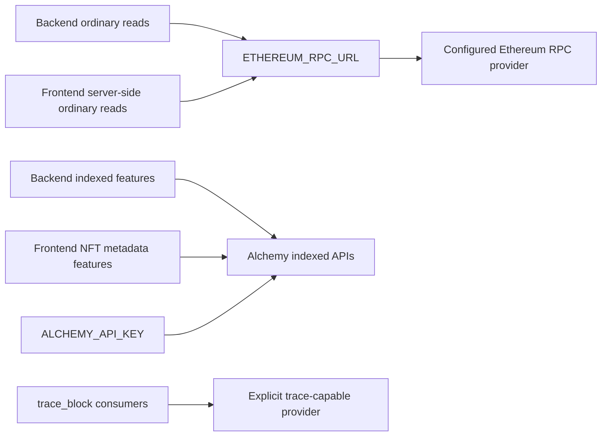

# Ethereum RPC Provider Portability

Status: Proposed

Owners: Backend and frontend

Canonical record: This document is the cross-repository source of truth for
the migration. The frontend-owned execution record is
[Ethereum RPC provider portability](https://github.com/6529-Collections/6529seize-frontend/blob/main/ops/workstreams/ethereum-rpc-provider-portability/README.md).

## Decision

All ordinary Ethereum mainnet JSON-RPC operations owned by the application
must use one server-side configuration value:

```text
ETHEREUM_RPC_URL
```

Initially, `ETHEREUM_RPC_URL` will point to an Alchemy Ethereum mainnet RPC
endpoint. Replacing Alchemy for ordinary calls must subsequently be a
configuration-only change: update this URL and redeploy the affected services.

For this decision, ordinary calls are:

- block number and block lookup;
- log lookup;
- transaction and transaction-receipt lookup;
- ENS resolution;
- contract code and read-only contract calls.

Alchemy-specific indexed products are not ordinary JSON-RPC and are not part
of the URL-only portability guarantee. They must remain isolated, named as
Alchemy dependencies, and continue to use `ALCHEMY_API_KEY` until separately
replaced:

- Alchemy NFT REST APIs;
- `alchemy_getAssetTransfers`.

`trace_block` is also outside the ordinary-call guarantee because it is a
non-standard RPC method. Its provider requirements and fallback behavior must
remain explicit.

## Why this boundary exists

The application no longer depends on the published `alchemy-sdk` package. The
backend instead has a local compatibility module at `src/alchemy-sdk.ts`.
However, that module still combines two different concerns:

1. standard Ethereum operations implemented through `ethers`; and
2. Alchemy-only indexed APIs implemented through Alchemy JSON-RPC and NFT REST
   endpoints.

Removing the external SDK therefore did not make runtime provider selection
configuration-only. Standard calls still derive Alchemy URLs from
`ALCHEMY_API_KEY` in several paths, while other paths use hard-coded or
separately configured RPC endpoints.

## Current state

### Backend

- `src/rpc-provider.ts` exposes an `ethers.JsonRpcProvider`, but its ordinary
  provider URL is constructed from `ALCHEMY_API_KEY` and an Alchemy hostname.
- `src/alchemy.ts` constructs the local Alchemy compatibility client and also
  exposes Alchemy-derived RPC URL helpers.
- `src/alchemy-sdk.ts` implements standard block, log, transaction, receipt,
  and ENS operations alongside `alchemy_getAssetTransfers` and Alchemy NFT REST
  operations.
- Some callers instantiate providers from `getRpcUrl()` or
  `getRpcUrlFromNetwork()` instead of using the shared provider factory.
- `src/external-indexing/external-indexer-rpc.ts` uses the separate
  `NFT_INDEXER_RPC` setting.
- `src/transaction_values.ts` uses non-standard `trace_block` and has a
  provider-specific fallback path.
- The API exposes a legacy AWS Managed Blockchain proxy under `/rpc`; its
  ownership and consumers must be established before it is retained, migrated,
  or removed.

### Frontend

- Server-side Open Graph code creates multiple Viem clients with default,
  hard-coded `rpc1.6529.io`, and public-node transports.
- Active `/api/alchemy/*` routes and Open Graph NFT metadata fallback code use
  Alchemy NFT REST APIs. Those are indexed-product dependencies and remain in
  scope for `ALCHEMY_API_KEY`, not `ETHEREUM_RPC_URL`.
- `services/alchemy-api.ts` and the implementation modules
  `services/alchemy/{index,collections,owner-nfts,tokens}.ts` have no production
  importers. Their only importer is `__tests__/services/alchemy-api.test.ts`.
- `services/alchemy/types.ts` and `services/alchemy/utils.ts` are active shared
  modules and are not dead code.

## Target architecture



The application must not infer the ordinary RPC URL from
`ALCHEMY_API_KEY`. Code using the ordinary provider must not import Alchemy
types, construct Alchemy hostnames, or rely on Alchemy response extensions.

`ETHEREUM_RPC_URL` is server-only configuration. It must not be exposed as a
`NEXT_PUBLIC_*` value or shipped to browser bundles.

## Backend implementation plan

### 1. Establish the configuration contract

- Add `ETHEREUM_RPC_URL` to backend environment schemas, samples, deployment
  configuration, and every deployable service that performs ordinary mainnet
  reads.
- Keep `ALCHEMY_API_KEY` only on services that call an Alchemy indexed API.
- Fail clearly when a required RPC URL is absent. After rollout, do not silently
  reconstruct an Alchemy URL as a fallback.
- Inventory non-mainnet calls before implementation. A single mainnet URL must
  not be reused for Sepolia, Goerli, Hoodi, or another chain. If those calls
  remain required, give them explicit provider-neutral configuration rather
  than deriving Alchemy hostnames from `ALCHEMY_API_KEY`.

### 2. Make the shared ordinary provider Alchemy-independent

- Change the shared provider factory to construct and cache the mainnet
  provider from `ETHEREUM_RPC_URL`.
- Move provider-neutral network identifiers and response types out of the
  Alchemy compatibility module where importing them would otherwise preserve a
  false Alchemy dependency.
- Preserve the retry, timeout, null-result, and numeric-conversion behavior on
  which existing callers rely.

### 3. Migrate ordinary callers

- Route block numbers, blocks, logs, transactions, receipts, ENS, contract
  code, and contract reads through the shared provider boundary.
- Replace direct uses of Alchemy-derived `getRpcUrl()` and
  `getRpcUrlFromNetwork()` for ordinary calls.
- Split mixed workflows so their ordinary lookups use the shared provider even
  when the same workflow still uses `alchemy_getAssetTransfers` or an Alchemy
  NFT endpoint.
- Update names, logs, tests, and mocks that call a standard provider “Alchemy”
  after it becomes provider-neutral.

### 4. Isolate provider-specific capabilities

- Retain a narrowly named Alchemy indexed client for NFT REST operations and
  `alchemy_getAssetTransfers`.
- Do not place standard RPC methods on that client after their callers migrate.
- Treat `trace_block` as a capability-specific provider. Verify that the
  intended initial endpoint supports it, retain an explicit fallback if needed,
  and document the failure behavior independently of ordinary RPC.
- Decide whether `NFT_INDEXER_RPC` intentionally represents a different
  reliability/capacity class. If it does, retain and document it. If it does
  not, migrate its ordinary reads to `ETHEREUM_RPC_URL`.

### 5. Resolve the legacy `/rpc` surface

- Identify current internal and external consumers of the AWS Managed
  Blockchain `/rpc` proxy.
- Remove it if unused. If it is still required, document its purpose and decide
  whether it should proxy `ETHEREUM_RPC_URL` or remain an explicitly separate
  integration.
- Do not treat this decision as a blocker for migrating unrelated ordinary
  server-side reads.

## Frontend implementation plan

The frontend owns a concise execution record in its `ops/workstreams/`
directory. Its implementation scope is:

1. Delete the unused `services/alchemy-api.ts` facade, the unused
   `services/alchemy/{index,collections,owner-nfts,tokens}.ts` implementations,
   and their orphaned test.
2. Retain `services/alchemy/types.ts` and `services/alchemy/utils.ts` while
   production code imports them.
3. Add one server-only provider-neutral construction path for ordinary
   mainnet reads and configure it with `ETHEREUM_RPC_URL`.
4. Migrate server-owned Open Graph block, ENS, and contract reads away from
   default and hard-coded transports.
5. Keep browser wallet transports and transaction submission outside this
   server-RPC decision. Wallet libraries must continue to follow their own
   chain and connector contracts.
6. Keep active Alchemy NFT routes and metadata fallbacks isolated and backed by
   `ALCHEMY_API_KEY` until a separate indexed-data replacement is selected.

## Rollout

### Phase 1: provider-neutral code, Alchemy endpoint

The implementation must refresh this source-derived inventory immediately
before changing runtime code. At the time of this decision, these backend
deployables contain confirmed ordinary-RPC call paths and therefore require
`ETHEREUM_RPC_URL`:

| Deployment | Ordinary-RPC responsibility |
| --- | --- |
| `api` | ENS resolution, wallet-signature and profile-CMS contract checks, NextGen validation, and other request-time contract reads |
| `discoverEnsLoop` | ENS reverse resolution for newly discovered wallets |
| `refreshEnsLoop` | ENS reverse-resolution refreshes |
| `delegationsLoop` | Block, log, transaction, and ENS reads |
| `nftsLoop` | Block and contract reads, including edition-size calculation |
| `nftHistoryLoop` | Block, transaction, and receipt reads alongside Alchemy asset transfers |
| `transactionsLoop` | Transaction, receipt, ENS, and trace reads alongside Alchemy asset transfers |
| `nextgenContractLoop` | Block, log, transaction, receipt, ENS, contract, and trace reads alongside Alchemy asset transfers |
| `tdhLoop` | Block and contract reads |
| `subscriptionsTopUpLoop` | Block reads alongside Alchemy asset transfers |
| `mintAnnouncementsLoop` | Manifold contract reads |
| `artCurationNftWatchLoop` | Art-curation contract reads |
| `populateHistoricConsolidatedTdh` | Manual historical block-timestamp reads |

`nftLinkRefresherLoop` is conditional. Its contract reads currently use
`NFT_INDEXER_RPC`; add it to this inventory only if the implementation decision
is to collapse that separate capacity boundary into `ETHEREUM_RPC_URL`.

The backend rollout is two ordered passes. Complete the entire configuration
pass before switching any runtime caller:

1. In local/development, staging, and production, provision
   `ETHEREUM_RPC_URL` with the current Alchemy mainnet endpoint. Do not remove
   `ALCHEMY_API_KEY` from indexed-product consumers.
2. Add environment wiring to each confirmed deployment above, then deploy the
   configuration-only change sequentially in this order: `api`,
   `discoverEnsLoop`, `refreshEnsLoop`, `delegationsLoop`, `nftsLoop`,
   `nftHistoryLoop`, `transactionsLoop`, `nextgenContractLoop`, `tdhLoop`,
   `subscriptionsTopUpLoop`, `mintAnnouncementsLoop`,
   `artCurationNftWatchLoop`, and `populateHistoricConsolidatedTdh`.
3. Verify each deployed service received the configuration without changing
   its provider behavior. Do not invoke `populateHistoricConsolidatedTdh`
   merely to verify configuration.
4. In a separate runtime pass, migrate and deploy the same sequence one service
   at a time. Verify ordinary reads against the configured Alchemy endpoint
   after each deploy and verify any colocated indexed Alchemy path still uses
   `ALCHEMY_API_KEY`.
5. If `nftLinkRefresherLoop` joins the canonical boundary, deploy it after the
   confirmed sequence and before removing `NFT_INDEXER_RPC` from any
   environment.
6. Migrate frontend server-side ordinary reads only after the backend runtime
   pass is complete.
7. Remove obsolete Alchemy-derived ordinary RPC helpers only after all backend
   and frontend callers have moved.

### Phase 2: URL-only provider replacement

1. Qualify the candidate endpoint for supported standard methods, chain ID,
   archive depth, log range limits, rate limits, timeouts, and production load.
2. Qualify `trace_block` separately; it is not implied by standard Ethereum
   JSON-RPC support.
3. Change `ETHEREUM_RPC_URL` and redeploy without application-code changes.
4. Monitor correctness, latency, throttling, and ingestion lag; roll back by
   restoring the previous URL if necessary.

## Acceptance criteria

- Changing the provider for ordinary mainnet calls requires changing only
  `ETHEREUM_RPC_URL` and redeploying affected services.
- Ordinary-call code contains no Alchemy hostname construction and requires no
  Alchemy API key.
- Blocks, logs, transactions, receipts, ENS, contract code, and contract reads
  have focused provider-boundary coverage.
- Alchemy NFT REST and `alchemy_getAssetTransfers` dependencies are visibly
  isolated and remain functional.
- `trace_block`, non-mainnet RPC, `NFT_INDEXER_RPC`, and `/rpc` have explicit
  documented dispositions rather than accidental fallback behavior.
- Frontend browser bundles do not contain `ETHEREUM_RPC_URL`.
- The unused frontend Alchemy service facade and implementations are removed,
  while active types and utilities remain.

## Non-goals

- Replacing Alchemy NFT REST or `alchemy_getAssetTransfers` in this migration.
- Removing `ALCHEMY_API_KEY` while indexed Alchemy products still use it.
- Routing wallet writes or user-selected wallet transports through the
  application server.
- Assuming every Ethereum provider supports tracing, indexed history, archive
  reads, or unrestricted log ranges.

## Open decisions to close during implementation

- Which deployable services require `ETHEREUM_RPC_URL` and which require only
  `ALCHEMY_API_KEY`?
- Which non-mainnet chains remain supported by server-owned ordinary calls, and
  what are their explicit provider-neutral configuration names?
- Does `NFT_INDEXER_RPC` represent a deliberately separate provider/capacity
  boundary?
- Which provider is authoritative for `trace_block`?
- Does the legacy AWS Managed Blockchain `/rpc` API have any supported
  consumers?
